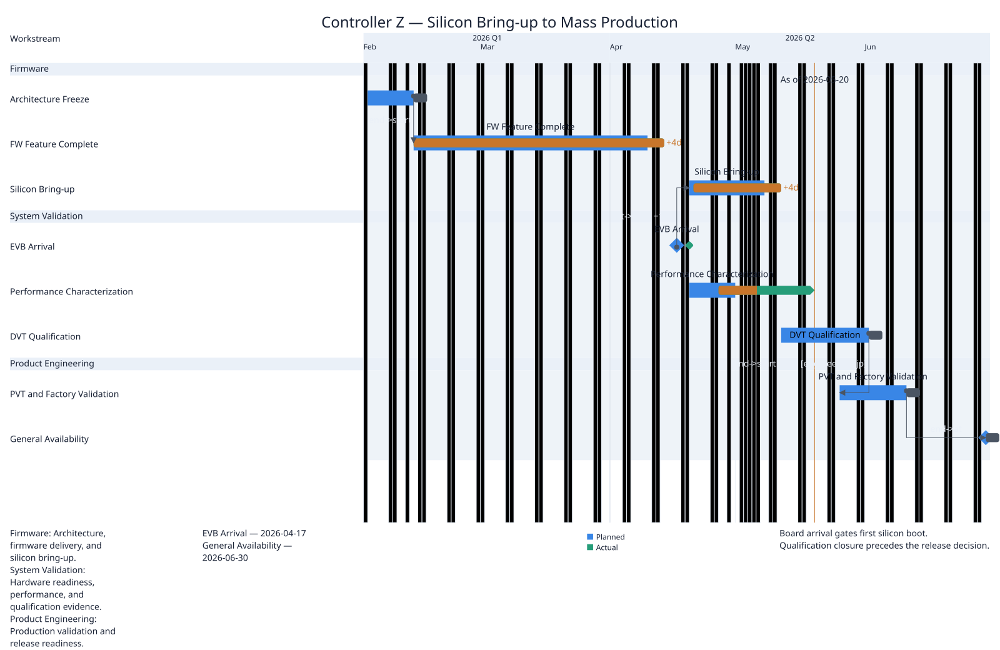

# Layout profile

Generated by `tools/render_design_gallery.py --root .`.

Design Space dimension: `composition`.

## Peers

### Executive review

Establish the spacious table-timeline composition.


Corpus: `controller-z` · slide: `executive` · [Context](../../../examples/controller-z/contexts/executive.yaml)

### Compact executive review

Compare denser Layout spacing over the identical review.



Corpus: `controller-z` · slide: `composition-compact` · [Context](../../../examples/controller-z/contexts/composition-compact.yaml)

## Presentation-reference diff

- `layout`: `executive-review` → `executive-review-compact`

## Referenced-resource YAML diff

The pair changes only `layout`.

```diff
--- executive-review.yaml
+++ executive-review-compact.yaml
@@ -1,9 +1,9 @@
-id: executive-review
+id: executive-review-compact
 requiredThemeTokens:
 - panel.minimum
-- spacing.l
 - spacing.m
 - spacing.none
+- spacing.s
 root:
   alignItems: stretch
   blockSize: fill
@@ -72,7 +72,7 @@
       padding:
         token: spacing.none
     gap:
-      token: spacing.l
+      token: spacing.m
     id: review
     inlineSize: fill
     justifyContent: start
@@ -159,12 +159,12 @@
     priority: optional
     source: annotations
   gap:
-    token: spacing.m
+    token: spacing.s
   id: page
   inlineSize: fill
   justifyContent: start
   kind: column
   padding:
-    token: spacing.l
+    token: spacing.m
 version: chrona/layout-profile/v0.4
 writingMode: horizontal-tb


## Accessibility

- Executive review: Semantic labels and table structure remain present as only Layout geometry changes.
- Compact executive review: Semantic labels and table structure remain present as only Layout geometry changes.
