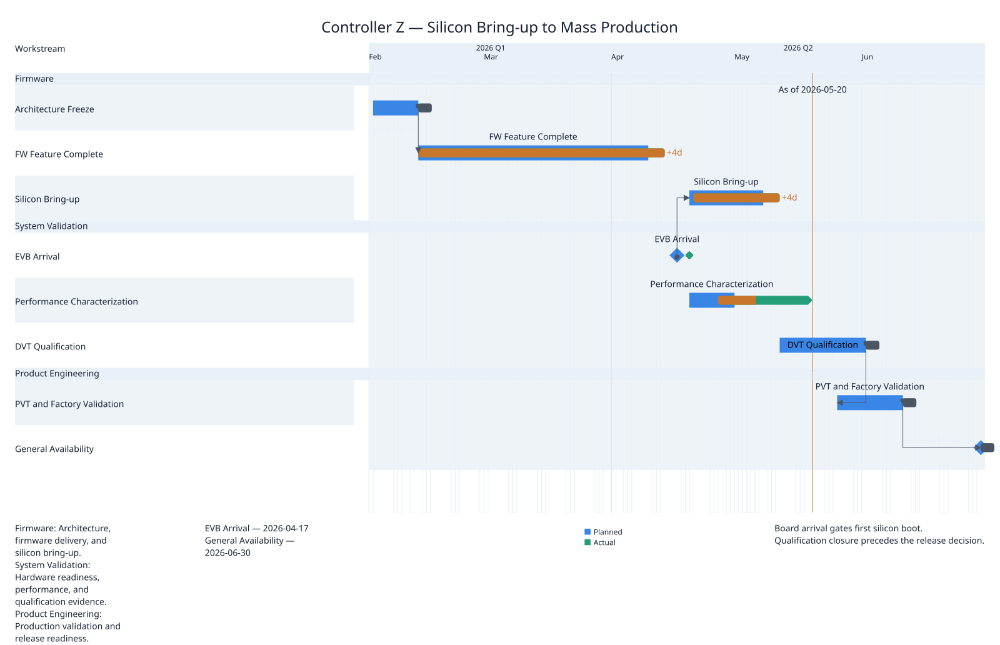
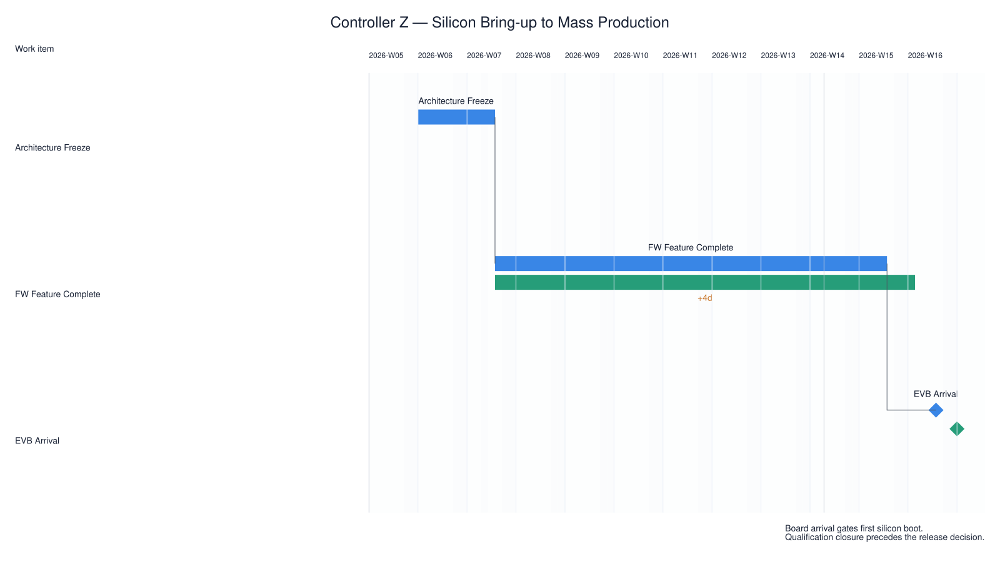

# comparison focus

Design Space dimension: `content`.

## Peers

### Executive status

Compare plan

Corpus: `controller-z` · slide: `executive` · [Context](../../../examples/controller-z/contexts/executive.yaml)

### Plan-only control

Focus the same schedule on planned commitments.

Corpus: `controller-z` · slide: `plan-only` · [Context](../../../examples/controller-z/contexts/plan-only.yaml)

## Presentation-reference diff

- `view`: `controller-z-executive` → `controller-z-plan-only`

## Accessibility

- Executive status: Semantic labels and table structure remain present alongside colour.
- Plan-only control: Semantic labels and table structure remain present alongside colour.
