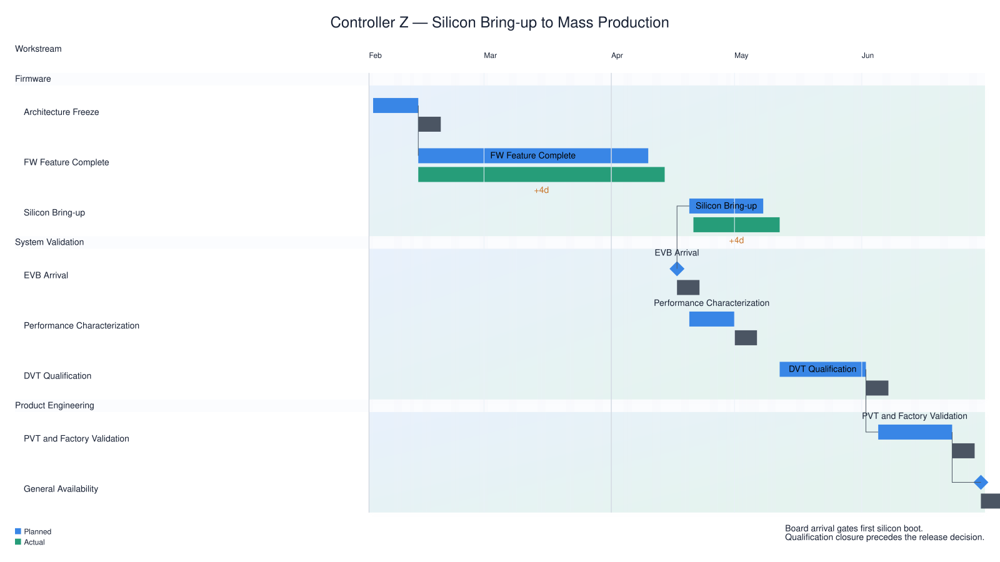

# visual treatment

Generated by `tools/render_design_gallery.py --root .`.

Design Space dimension: `appearance`.

## Peers

### Baseline treatment

Establish the ordinary status-review treatment.


Corpus: `controller-z` · slide: `executive` · [Context](../../../examples/controller-z/contexts/executive.yaml)

### Elevated status review

Compare bounded portable visual treatment on the same review.



Corpus: `controller-z` · slide: `elevated` · [Context](../../../examples/controller-z/contexts/elevated.yaml)

## Presentation-reference diff

- `theme`: `executive-light` → `elevated-light`

## Referenced-resource YAML diff

The pair changes only `theme`.

```diff
--- executive-light.yaml
+++ elevated-light.yaml
@@ -13,6 +13,9 @@
     critical-edge.stroke: negative
     dependency.stroke: textMuted
     group-band.fill: category:default
+    group-band.gradientEnd: positive
+    group-band.gradientStart: accent
+    group-band.shadowColor: neutral
     group-header-band.fill: surfaceRaised
     group:factory-team.fill: category:factory-team
     group:fw-team.fill: category:fw-team
@@ -80,7 +83,14 @@
       marker: dependency-marker
       strokeWidth: stroke-width
     group-band:
+      gradientAngle: elevated.gradient-angle
+      gradientFidelity: elevated.fidelity
       opacity: opacity.group-band
+      shadowBlur: elevated.shadow-blur
+      shadowFidelity: elevated.fidelity
+      shadowOffsetX: elevated.shadow-offset-x
+      shadowOffsetY: elevated.shadow-offset-y
+      shadowOpacity: elevated.shadow-opacity
     group-header-band:
       opacity: opacity.group-header-band
     heading:
@@ -134,6 +144,24 @@
     editorial:
       type: fontFamily
       value: Noto Sans CJK JP
+    elevated.fidelity:
+      type: fidelity
+      value: required
+    elevated.gradient-angle:
+      type: number
+      value: 35
+    elevated.shadow-blur:
+      type: number
+      value: 3
+    elevated.shadow-offset-x:
+      type: number
+      value: 1
+    elevated.shadow-offset-y:
+      type: number
+      value: 2
+    elevated.shadow-opacity:
+      type: number
+      value: 0.28
     heading-line-height:
       type: number
       value: 1.2
@@ -230,6 +258,6 @@
     timeline-row-height:
       type: number
       value: 72
-id: executive-light
+id: elevated-light
 kind: theme
 version: chrona/theme/v0.5


## Accessibility

- Baseline treatment: Semantic labels and table structure remain present alongside colour.
- Elevated status review: Gradient and shadow are decorative; semantic labels
