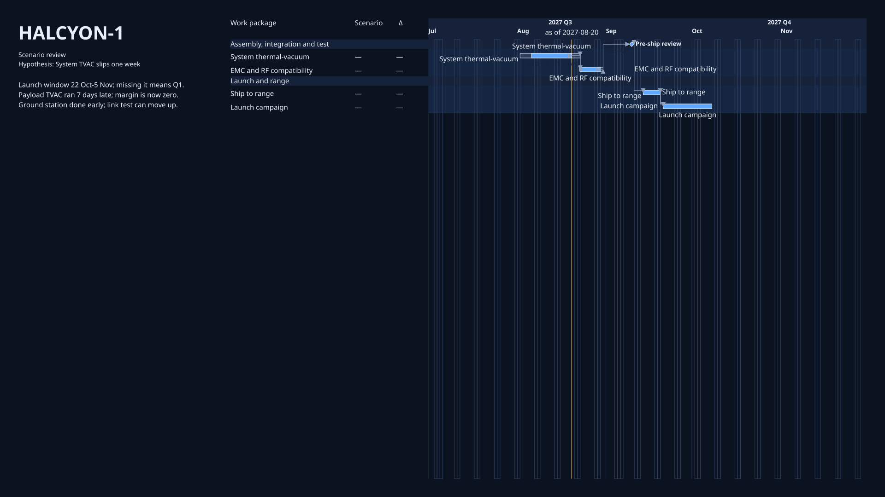
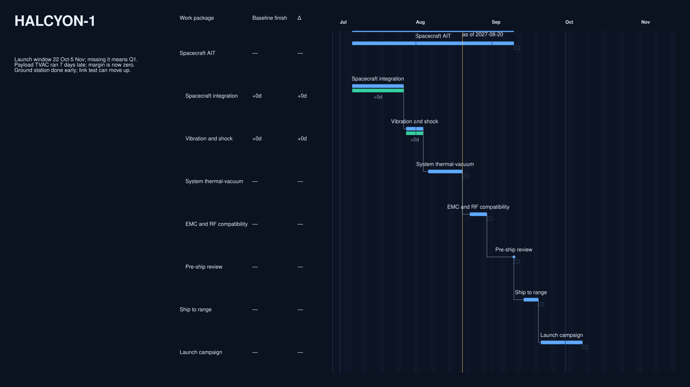

# comparison baseline

Generated by `tools/render_design_gallery.py --root .`.

Design Space dimension: `content`.

## Peers

### TVAC slip scenario

Investigate the primary plan under the declared TVAC slip scenario.



Corpus: `halcyon-1` · slide: `tvac-slip` · [Context](../../../examples/halcyon-1/contexts/04-tvac-slip.yaml)

### Captured replan baseline

Investigate the same programme against its pinned June baseline.



Corpus: `halcyon-1` · slide: `replan-baseline` · [Context](../../../examples/halcyon-1/contexts/07-replan-baseline.yaml)

## Presentation-reference diff

- `view`: `halcyon-04-tvac-slip` → `halcyon-07-replan-baseline`

## Referenced-resource YAML diff

The pair changes only `view`.

```diff
--- 04-tvac-slip.yaml
+++ 07-replan-baseline.yaml
@@ -7,8 +7,8 @@
       unit: month
     ticks: week
   comparison:
-    actual: required
-    baseline: scenario
+    actual: optional
+    baseline: snapshot
     deltaUnit: calendar-days
     facets:
     - planned
@@ -17,15 +17,11 @@
     - missingActual
     - unmatchedActual
     observationSelection: latest
-    scenario: tvac-slip
   grouping:
-    by: field
-    field: owner
+    by: hierarchy
+    depth: 1
     missing: ungrouped
-    order:
-    - ait
-    - launch
-    presentation: header
+    rollup: bar
   layoutIntent:
     compactness: compact
     itemStacking: stable
@@ -39,10 +35,12 @@
     tieBreak: id
   rows:
     mode: automatic
-    points: group-header
   selection:
     include:
       ids:
+      - spacecraft-ait
+      - integration
+      - vibration
       - tvac
       - emc
       - psr
@@ -59,10 +57,11 @@
   - id: Work package
     missing: em-dash
     source: title
-  - id: Scenario
+  - format: signedDays
+    id: Baseline finish
     missing: em-dash
     source:
-      scenario: title
+      comparisonFacet: finishDelta
   - format: signedDays
     id: "\u0394"
     missing: em-dash
@@ -82,9 +81,9 @@
       mode: semantic
       overflow: suppress
   window:
-    end: '2027-12-01'
+    end: '2027-11-15'
     mode: explicit
-    start: '2027-07-01'
-id: halcyon-04-tvac-slip
+    start: '2027-06-28'
+id: halcyon-07-replan-baseline
 kind: view
 version: chrona/view/v0.12


## Accessibility

- TVAC slip scenario: Scenario differences remain expressed in structured labels and comparison facets.
- Captured replan baseline: Baseline comparison remains expressed in structured labels and comparison facets.
