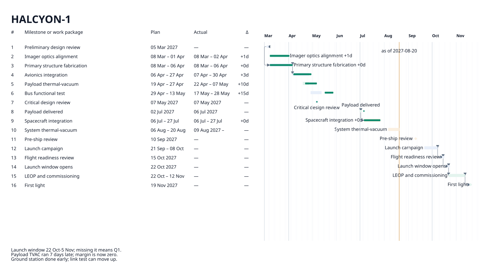
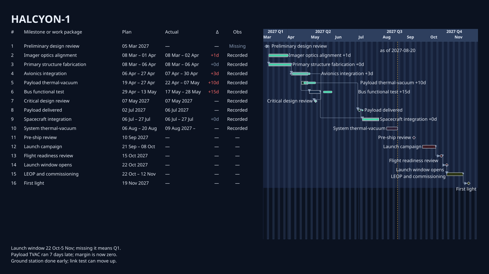
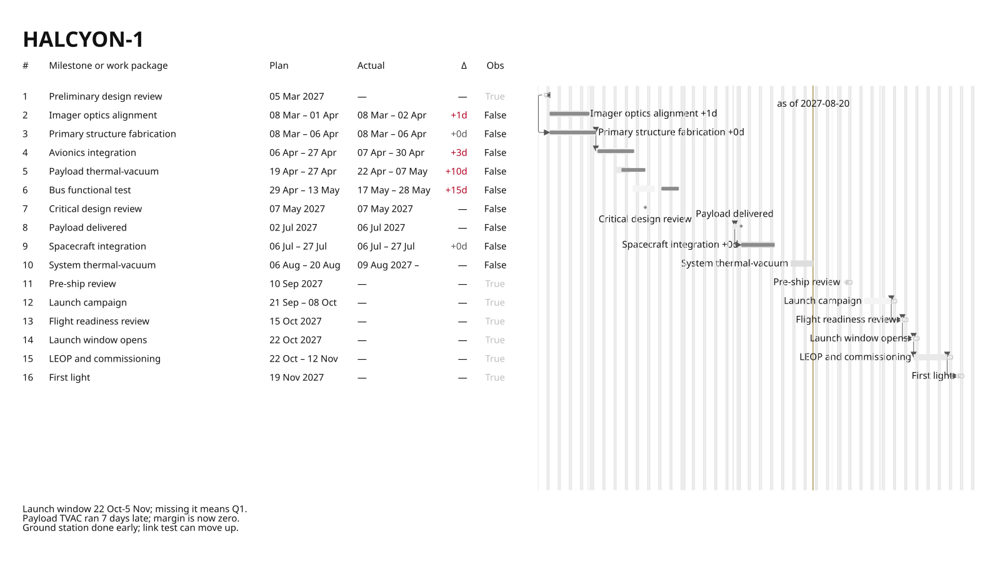

# colour scheme

Generated by `tools/render_design_gallery.py --root .`.

Design Space dimension: `appearance`.

## Peers

### Mission light

Establish the light appearance for the same mission brief.

Corpus: `halcyon-1` · slide: `mission-brief` · [Context](../../../examples/halcyon-1/contexts/01-mission-brief.yaml)

### Control room dark

Compare the same mission brief in a dark operational scheme.

Corpus: `halcyon-1` · slide: `gallery-dark` · [Context](../../../examples/halcyon-1/contexts/08-gallery-dark.yaml)

### Print mono

Compare the same mission brief in a monochrome scheme.

Corpus: `halcyon-1` · slide: `gallery-mono` · [Context](../../../examples/halcyon-1/contexts/09-gallery-mono.yaml)

## Presentation-reference diff

- `colorScheme`: `mission-light` → `control-room-dark` → `print-mono`

## Accessibility

- Mission light: Semantic labels and table structure remain present in the light scheme.
- Control room dark: Semantic labels and table structure remain present in the dark scheme.
- Print mono: Semantic labels and table structure remain present without colour distinction.
