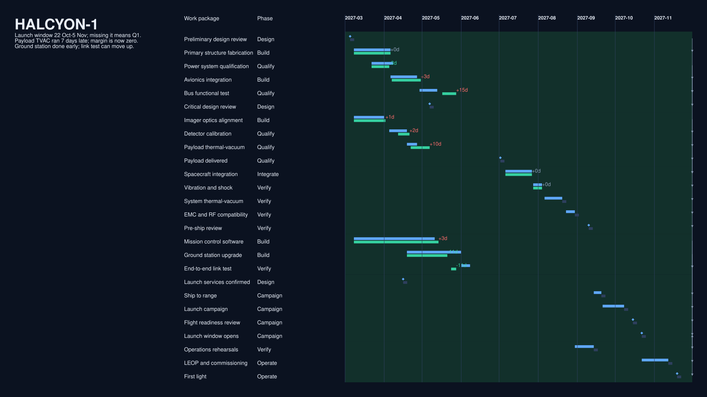
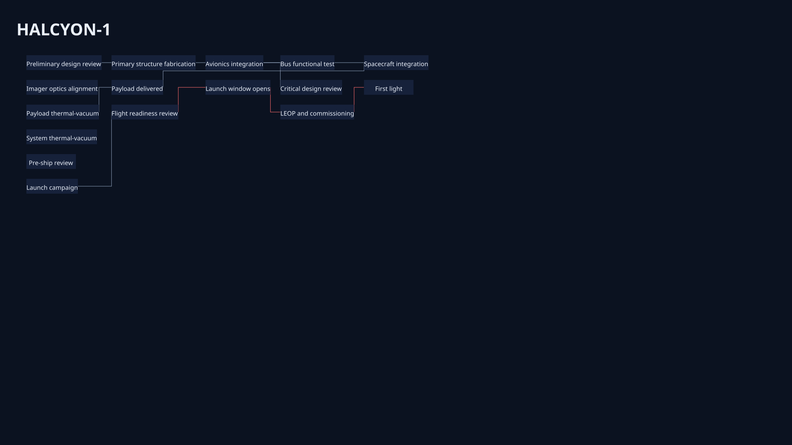

# surface

Generated by `tools/render_design_gallery.py --root .`.

Design Space dimension: `content`. Coupled support: `layout`.

## Peers

### Programme board

Read the programme as a table timeline.

Corpus: `halcyon-1` · slide: `programme-board` · [Context](../../../examples/halcyon-1/contexts/02-programme-board.yaml)

### Dependency network

Read the same programme through its dependency structure.

Corpus: `halcyon-1` · slide: `gallery-network-wallboard` · [Context](../../../examples/halcyon-1/contexts/10-gallery-network-wallboard.yaml)

## Presentation-reference diff

- `view`: `halcyon-02-programme-board` → `halcyon-05-dependency-network`
- `layout`: `wallboard` → `dependency-network`

## Accessibility

- Programme board: Structured labels and semantic roles remain available in the table timeline.
- Dependency network: Semantic labels and relation roles remain present alongside the network marks.
