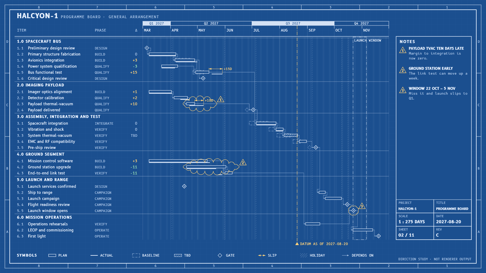

# HALCYON-1 target "Blueprint": the programme board as an engineering drawing

A hand-drawn design target, approved by the product owner on 2026-09-26 as one of seven added together (Swiss Grid, Blueprint, Transit Map, Pixel Quest, Pastel Symmetry, One Bit, Flat Pack), alongside target B (#453) and the earlier targets in sibling folders under `docs/research/presentation/`. It is **not** chrona output. The coordinates are written by hand in `blueprint-board.html`, and text widths are estimated, not measured.

The data and canvas are the same as the other targets: the HALCYON-1 programme board, 26 work packages in six groups, baseline, plan and actual, dependencies, as-of 2027-08-20, three annotations and the launch window, on 1600 × 900.

## What the direction is

An engineering drawing on blueprint paper: white linework, a drawing frame with zone letters and numbers, a title block, dimension lines and revision clouds. It is practical for engineering audiences: the notation is already familiar.

| Element | Chart element | chrona role | Today |
| --- | --- | --- | --- |
| Drawing frame with zones A–D, 1–8 | Slide | border and zone references in the margin | no frame treatment |
| Title block: project, title, scale, date, sheet, revision | Title | labelled field cells at bottom right, filled from project facts | no field grid (also Tenth Frame) |
| `SCALE 1 : 275 DAYS` | Header figure | derived from the window | no derived figures (also Title Card) |
| Dimension lines `+15D`, `+10D` | Slips | dimension between planned and actual finish, with extension lines and arrowheads | no dimension annotation |
| Revision clouds and delta tags ①②③ | Annotations | scalloped outline around the subject; the tag number repeats in the notes block | no cloud or tag shape; notes block placement (#466) |
| Item numbers `2.3` | Table | outline numbering derived from group and order | no derived numbering column |
| Outline plan, solid actual, centre-line baseline | Marks | line-only mark treatments | expressible (#398, dash #423) |

## What this target adds beyond the others

1. **Dimension annotations**: a slip shown as a measured span between two dates, generated from the data rather than authored.
2. **Revision clouds**: an annotation that outlines its subject instead of pointing at it.
3. **Derived outline numbering** in the table.

## Regenerating the image

Open `blueprint-board.html` in a browser. The PNG in this folder was produced with headless Chrome, at a 1600 × 900 window, from a copy of the page that shows only the slide:

    "Google Chrome" --headless=new --hide-scrollbars --window-size=1600,900 \
      --virtual-time-budget=12000 --screenshot=02-programme-board.png stage-only.html
