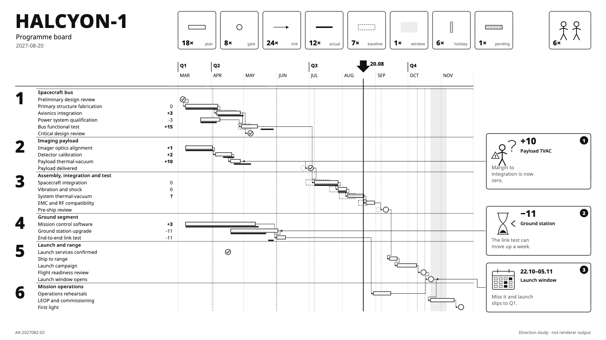

# HALCYON-1 target "Flat Pack": the programme board as flat-pack assembly instructions

A hand-drawn design target, approved by the product owner on 2026-09-26 as one of seven added together (Swiss Grid, Blueprint, Transit Map, Pixel Quest, Pastel Symmetry, One Bit, Flat Pack), alongside target B (#453) and the earlier targets in sibling folders under `docs/research/presentation/`. It is **not** chrona output. The coordinates are written by hand in `flatpack-board.html`, and text widths are estimated, not measured.

The data and canvas are the same as the other targets: the HALCYON-1 programme board, 26 work packages in six groups, baseline, plan and actual, dependencies, as-of 2027-08-20, three annotations and the launch window, on 1600 × 900.

## What the direction is

Flat-pack furniture assembly instructions: black line art on white, as few words as possible, an inventory of parts at the top, numbered steps, pictograms for anything that can go wrong. No retailer's name, product names or characters are used.

| Element | Chart element | chrona role | Today |
| --- | --- | --- | --- |
| Parts inventory `18×` `8×` `24×` … | Legend | each legend entry boxed, with a count derived from the data | legend has no counts (#427) |
| Step numerals `1` … `6` | Group headers | a large numeral spanning the group's rows | no row-spanning group column (also Yuya) |
| Ticked gates | Gates | gate glyph by state: ticked before as-of, open after | #464; no state-dependent glyph |
| Outlined plan, heavy actual | Marks | line art only, no colour | expressible |
| Pictogram notes: puzzled figure, hourglass, calendar | Annotations | a pictogram chosen by note kind, a large figure, short text | icons beside note text exist; no kind-to-icon rule |
| Heavy arrow `20.08` | As-of | arrow marker and date | label (#428) |
| `6×` two-person box | Title area | team count shown as a pictogram | no derived figures |

## What this target adds beyond the others

1. **Counts in the legend**, derived from the data.
2. **State-dependent glyphs**: a gate drawn differently before and after as-of.
3. **Kind-to-pictogram rules** for notes.

## Regenerating the image

Open `flatpack-board.html` in a browser. The PNG in this folder was produced with headless Chrome, at a 1600 × 900 window, from a copy of the page that shows only the slide:

    "Google Chrome" --headless=new --hide-scrollbars --window-size=1600,900 \
      --virtual-time-budget=12000 --screenshot=02-programme-board.png stage-only.html
