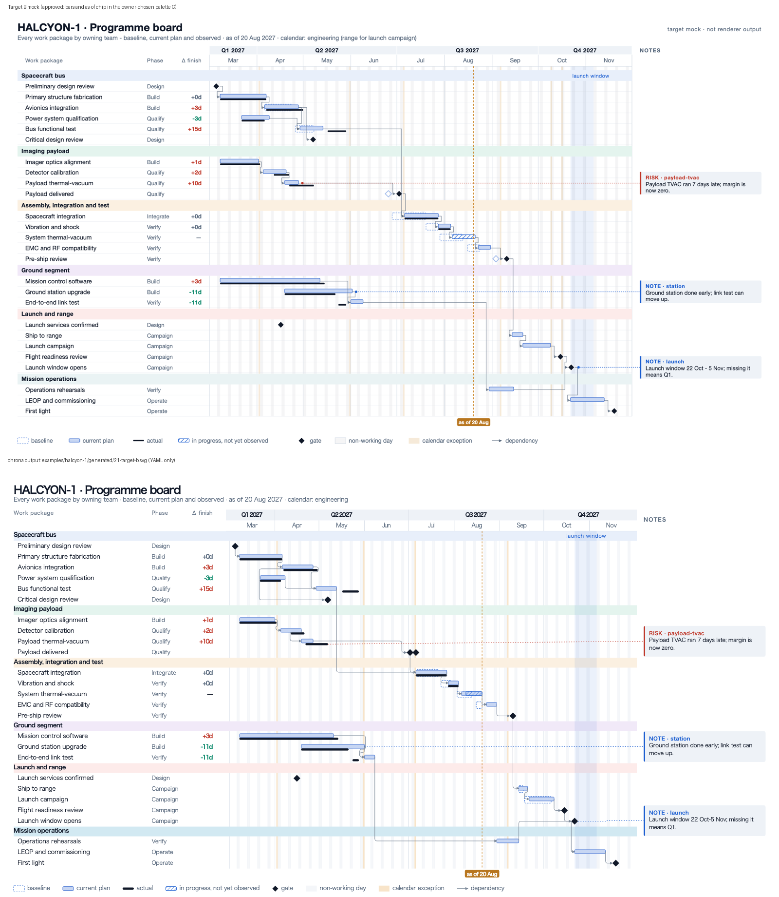

# HALCYON-1 target slides — generator

`render_mocks.py` draws the hand-drawn target renderings beside this README:
three layout proposals (`board`, `sidebar`, `dossier`) x three views (`01-mission-brief`,
`02-programme-board`, `03-launch-campaign`). They are **not** renderer output; they are the
picture issues #41, #42 and #46 aim at, drawn from the `examples/halcyon-1` dataset
(scheduler placements for the plan, `actual.yaml` observations through its `asOf` date of
2027-08-20, and an illustrative baseline that the example does not yet carry).

The committed `board/`, `sidebar/` and `dossier/` directories each contain
the SVG source and PNG render for all three views. [Target B](board/02-programme-board.png)
is the approved light programme-board yardstick used by #453. These are
research references, not Chrona-generated examples or materializer output.

```sh
python docs/research/presentation/halcyon-1-target-design-2026-09-21/render_mocks.py /tmp/halcyon-mocks
# rasterise the resulting SVGs with CairoSVG at scale 1.5 to inspect PNGs
```

Compare against `examples/halcyon-1/generated/*.svg`, which is what `chrona render-review`
produces from the same project today.

| Element of the mock | Issue |
|---|---|
| Baseline ghost (dashed outline) + current plan (fill) + actual (thin dark bar) on one row | #42 section 1, #41 section 4 |
| Group header named once — band (`board`), rule (`sidebar`), tinted strip (`dossier`) | #42 section 2 |
| Quarter band over short month labels; weekend stripes, calendar exceptions, launch-window band | #42 section 3 |
| As-of line at the Actual set's cutoff | #42 section 3 |
| Delta-finish per row; hatched bar for in-progress work with no observation | #42 section 6 |
| Callouts: rail beside the timeline (`board`), numbered sidebar notes (`sidebar`), circled footnotes (`dossier`) | #41 section 5, #42 section 5 |
| Legend with swatches drawn from the same roles as the marks | #42 section 4 |

| Proposal | Idea | Scheme | Canvas |
|---|---|---|---|
| `board/` | table (work package, delta finish) beside the timeline, callout rail on the right | `mission-light` | 1600 x 900 |
| `sidebar/` | no table: labels on the plot; title, key figures and numbered notes in a left sidebar | `control-room-dark` | 1920 x 1080 |
| `dossier/` | print dossier: numbered rows with plan / actual / delta columns, outlined plan bars | `print-mono` | 1200 x 1120 |

## Parts catalogue (#718)

The reusable parts of this target are extracted as monochrome assets in the packaged catalogue `chrona-target-parts-v2026-10` (set `chrona-target-parts`; see [the gallery](../target-parts-catalogue-2026-10/README.md)). A part carries no colour: the Theme paints it. `chrona-starter` is the older builtin catalogue.

| Part drawn here | Catalogue entry | Status |
| --- | --- | --- |
| Gate diamond and its hollow baseline | `chrona-target-parts:diamond`, `diamond-outline` | in the catalogue; bindable as a gate symbol today |
| Hatch for in-progress work | `chrona-target-parts:hatch-wide` | in the catalogue; bindable as a pattern on the Rect roles today |

Still needed before this target's preset can be assembled: #582 (the labelled launch-window band), #583 (per-group tint), #584 (kind header and accent bar on a note). The per-target gap map is in #453.

## Target B reproduction (#987)



The top image is the approved target B mock. Its plan bars and as-of chip are redrawn in palette C, which the owner chose on 2026-10-03; everything else is as approved. The bottom image is `examples/halcyon-1/generated/21-target-b.svg` on main (2026-10-06). It is rendered from the HALCYON-1 project with YAML only: View `views/21-target-b.yaml`, Theme `themes/target-b.yaml`, scheme `schemes/target-b.yaml`, Layout and profile `layouts/target-b.yaml` and `profiles/target-b-detail.yaml`, and Context `contexts/21-target-b.yaml`. It is also the README hero image.

### Gap table

Classification: (a) tuned in YAML; (b) a missing general knob, filed and delivered; (c) a deliberate difference.

| Element | Result | Class | Through |
|---|---|---|---|
| Title, subtitle, column headers, row and group text sizes; muted Phase column and legend | matches | a, b | #1061, #1062 |
| Group header bands tinted per team; weekend stripes and calendar exceptions under the bands | matches | a, b | #583, #1019, #1034 |
| Two-tier axis; faint launch-window band with a lowercase label | matches | a, b | #426, #582, #1061 |
| Baseline ghost, plan bar, actual line and in-progress hatch: heights, offsets and radii from the mock | matches | a, b | #1061, #1147, #1066 |
| Gates as 14 px diamonds; actual gate legible | matches | a, b | #1066, #1074 |
| As-of line, and a 68 × 16 chip below the plot with white 10.5 px bold text | matches | a, b | #1063, #1110, #1126 |
| Notes rail: NOTES heading, 250 px aligned boxes, kind accent flush at full height, 3 px radius, kind-coloured header, wrapped body | matches | a, b | #1049, #1051, #1064, #1087 |
| Note text stays inside its box in any viewer font | matches | b | #1050, #1096 |
| Legend: 22 × 12 keys, 6 px key gap, 26 px entry gap, mock order | matches | a, b | #1061, #1111 |
| Child rows indented under group headers | matches | b | #1065 |
| Dependencies: muted 1 px lines with 4 px rounded elbows, triangle heads and no source dot. All 24 enter their target from the side at mid-height, abutting chains back-route, and arrivals at one start share one head | matches | b | #1030, #1044, #1046, #1059, #1060, #1105, #1109, #1114 |
| Plan-bar and as-of colours | palette C instead of the original mock blue | c | owner decision, 2026-10-03 |
| Subtitle "(range for launch campaign)" | absent: the heading shows the slide calendar only | c | #1026 tracks calendar titles |
| `avionics → CDR` and the actual gates on CDR and Payload delivered | drawn (the mock's data has neither) | c | project data |
| Face | Noto Sans (packaged) instead of the mock's system UI face | c | packaged fonts |
