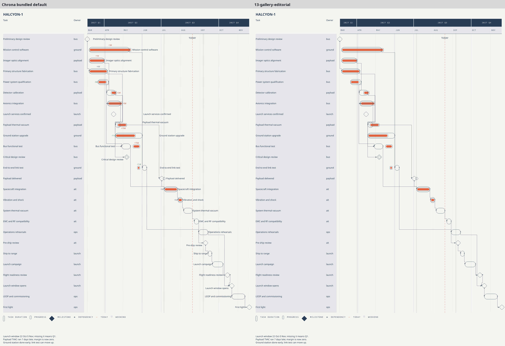
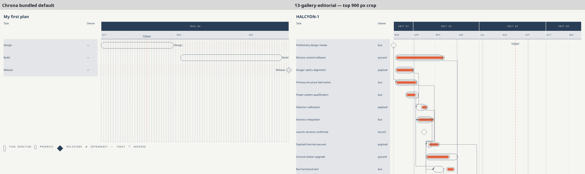
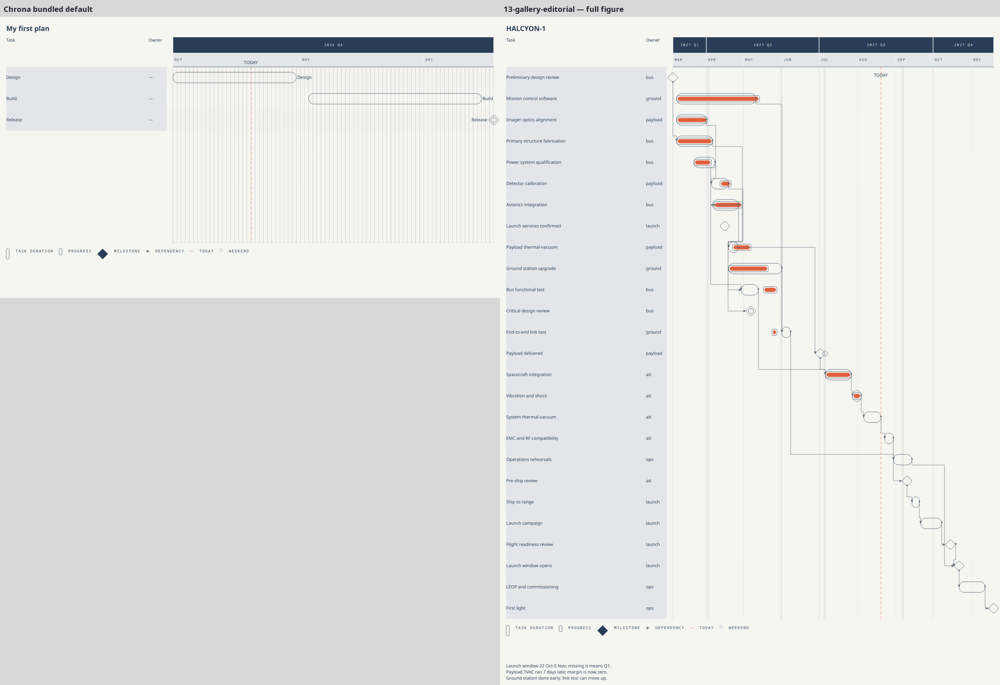

# #498 bundled-default readability evidence (I2)

This evidence compares the published I1 bundled default (`chrona-default-draft`)
with the unchanged `13-gallery-editorial` reference, using the same HALCYON-1
Project, Actual Set, viewport, Editorial Scheme, Layout, and detail profile.
The starter comparison uses the actual editable files emitted by `chrona init`.
All captures are draft renders, not immutable materializer evidence.

## Visual comparison

HALCYON-1 full figures, rendered at their natural 1600 × 2140 px size:



The starter is 1600 × 900 px while the full gallery figure is 1600 × 2140 px;
the full comparison therefore retains a blank lower-left panel. The following
same-scale top crop is provided for typography, palette, names, and axis
comparison (both panels remain at native 1600 × 900 px, with no rescaling):



The full starter/reference figures are also retained for context:



Visual inspection at readable scale: row bands are faint but discernible warm
alternation; navy names are on their own rows and terminate at the bar edge;
the red as-of line, axis and grid retain the Editorial treatment. The default
Theme's warm-tinted fill (`#EFE7DE`) at 0.12 opacity is visibly subordinate to
the unchanged raised table-column ground (`#E3E5E9`) against paper
(`#F5F5F1`). The reference retains its original gray column ground. Table
names remain visible for all three HALCYON rows whose member-label callouts
are intentionally suppressed; the suppression count and identities are
recorded below. This evidence does not claim warm-tint acceptance beyond this
visual review.

## Scene/SVG evidence

| Measure | Bundled default HALCYON | Editorial reference | Init starter |
| --- | ---: | ---: | ---: |
| Rows / planned bars | 26 / 26 | 26 / 26 | 3 / 3 |
| Alternating row-band primitives | 13 | 0 | 2 |
| Member-name labels | 23 | 0 | 3 |
| Independent variance labels | 12 | 0 | 0 |
| Suppressed member labels | 3 | 0 | 0 |

The default adds 48 primitives to the reference Scene: 13 row bands, 23 member
names, and 12 independently placed variance labels. The three member-label
suppression identities are `eps`, `detector`, and `avionics`; no variance
labels are silently suppressed. Names remain row-local and at their own bar
end/start, while variance labels retain existing independent Layout behavior
and semantic colors (ahead green, on-plan navy, behind red). Row bands and
their edge guides span all rows through the plot end. The 48 axis primitives
have identical IDs, bounds, text, and paint in both Scenes. Rows and slots
match exactly; every common primitive record is unchanged. Thus the Scene
change is additive, with no geometry or axis regression. The SVG contains the
same rows, member/variance labels, bands, and unchanged axis; both artifacts
are retained for inspection.

## Appearance and source comparison

The default derives from Editorial rather than changing the example-gallery
appearance: it keeps the same Editorial Scheme, Layout, axis hierarchy,
geometry, Noto Sans typography and type sizes. Scheme colors include paper
`#F5F5F1`, raised column ground `#E3E5E9`, navy text `#293E56`, coral accent
`#E2603D`, positive `#3B7D5A`, and negative `#B4432E`; category default is
`#EFE7DE`. Only row-band opacity/fill and the resource identities differ in
the candidate Theme/View. `13-gallery-editorial` generated SVG and Scene are
unchanged at I1 (`git diff e732c1c1^ e732c1c1 -- examples/halcyon-1/generated/13-gallery-editorial.svg examples/halcyon-1/generated/13-gallery-editorial.scene.json`
was empty). The captured reference SVG SHA-256 equals the committed public
gallery SVG; its Scene is copied byte-for-byte from the committed public
gallery Scene because the render CLI does not expose the gallery's inspection
Scene emission path.

## Reproduction

Run from repository root with the project `.venv` installed. Commands assume
`EVIDENCE=docs/research/presentation/issue-498-bundled-default-readability-evidence-2026-09-27`.
`chrona init` writes the starter to a fresh temporary directory; the resulting
source files are copied into the evidence folder.

```bash
EVIDENCE=docs/research/presentation/issue-498-bundled-default-readability-evidence-2026-09-27
mkdir -p "$EVIDENCE/halcyon-1" "$EVIDENCE/starter" "$EVIDENCE/starter-source" "$EVIDENCE/13-gallery-editorial"

# Actual minimal starter source (the evidence copies are byte-identical).
INIT_DIR=$(mktemp -d)
.venv/bin/chrona init "$INIT_DIR"
cp "$INIT_DIR/project.yaml" "$EVIDENCE/starter-source/project.yaml"
cp "$INIT_DIR/actual.yaml" "$EVIDENCE/starter-source/actual.yaml"

# Bare bundled default, HALCYON-1 Project + Actual Set.
.venv/bin/chrona render examples/halcyon-1/project.yaml --actual examples/halcyon-1/actual.yaml --viewport 1600xauto --output "$EVIDENCE/halcyon-1/default.svg" --emit-scene "$EVIDENCE/halcyon-1/default.scene.json"
.venv/bin/chrona render examples/halcyon-1/project.yaml --actual examples/halcyon-1/actual.yaml --viewport 1600xauto --format png --output "$EVIDENCE/halcyon-1/default.png"

# Actual init starter using the bundled default.
.venv/bin/chrona render "$EVIDENCE/starter-source/project.yaml" --actual "$EVIDENCE/starter-source/actual.yaml" --viewport 1600xauto --output "$EVIDENCE/starter/default.svg" --emit-scene "$EVIDENCE/starter/default.scene.json"
.venv/bin/chrona render "$EVIDENCE/starter-source/project.yaml" --actual "$EVIDENCE/starter-source/actual.yaml" --viewport 1600xauto --format png --output "$EVIDENCE/starter/default.png"

# Reference SVG with the original Editorial View/Theme/Scheme/Layout and
# gallery detail. Capture its authoritative Scene from the checked-in output.
.venv/bin/chrona render examples/halcyon-1/project.yaml --actual examples/halcyon-1/actual.yaml --view examples/halcyon-1/views/editorial.yaml --theme examples/halcyon-1/themes/editorial.yaml --scheme examples/halcyon-1/schemes/editorial.yaml --layout examples/halcyon-1/layouts/editorial.yaml --detail examples/halcyon-1/profiles/editorial-detail.yaml --viewport 1600x900 --output "$EVIDENCE/13-gallery-editorial/reference.svg"
.venv/bin/chrona render examples/halcyon-1/project.yaml --actual examples/halcyon-1/actual.yaml --view examples/halcyon-1/views/editorial.yaml --theme examples/halcyon-1/themes/editorial.yaml --scheme examples/halcyon-1/schemes/editorial.yaml --layout examples/halcyon-1/layouts/editorial.yaml --detail examples/halcyon-1/profiles/editorial-detail.yaml --viewport 1600x900 --format png --output "$EVIDENCE/13-gallery-editorial/reference.png"
cp examples/halcyon-1/generated/13-gallery-editorial.scene.json "$EVIDENCE/13-gallery-editorial/reference.scene.json"

# Rebuild the full-figure and same-scale comparison boards.
.venv/bin/python "$EVIDENCE/compose_comparison.py"

# Official gates.
.venv/bin/python tools/check_starter_perceptibility.py
.venv/bin/python tools/regenerate_public_examples.py --check
```

`chrona init` requires an empty/nonexistent output directory; `mktemp -d`
supplies one. The captures were produced at I1 commit
`e732c1c1bd393b13ea739b89389799af38fe309e`.

## Gate results and SHA-256

- `tools/check_starter_perceptibility.py`: **PASS (0 errors)**.
- `tools/regenerate_public_examples.py --check`: **PASS (28 slides)**.
- The generated starter capture emitted a non-gating
  `W_LAYOUT_LABEL_OVERFLOW` for the `as-of-label`; it does not refer to member
  names. HALCYON's bare render emitted informational
  `I_LAYOUT_PLOT_LABELS_SUPPRESSED count=3`, matching the three intentional
  member-label suppressions above.
- `13-gallery-editorial` committed SVG hash is unchanged:
  `026b124709cd2841172a6a58c7c2e6b7c017527cd4126d47bd76f0ba2953b313`.
- `13-gallery-editorial` committed Scene hash is unchanged:
  `959741a31ec450d926cc3c3497cbc1f5da1af916542b588674f0777ef4bc856a`.

Source inputs (including the two new default resources and the legacy
Editorial inputs used for the reference):

| Source | SHA-256 |
| --- | --- |
| `src/chrona/resources/presets/default.yaml` | `123c75185f89aa10a2239af60fe8c51cafafe80f19e3a2d06e7c1ff8b6f4e50f` |
| `src/chrona/resources/presets/bundles/editorial-readable-default/view.yaml` | `9468d74b8801e39382d3b930096a3285fca7333ee3421d6ef04f42f13368b8d2` |
| `src/chrona/resources/presets/bundles/editorial-readable-default/theme.yaml` | `3f9b865c129de6cb2544baab648d5bd0cf728e88d39fb3008900185381aacce5` |
| HALCYON `project.yaml` | `25b28b18d9e9ad1d60dd75a9263dd420eb1ca4fc3e25eb016868e9cb98503bc2` |
| HALCYON `actual.yaml` | `a6649c71433354a8d0227948ef3915e311fdcdfb4d14f8ed53654495b8bc4314` |
| `views/editorial.yaml` | `6070902602ae311ab4170615a944a8c5b225f54f02c81ef73039a9b8b7f4be99` |
| `themes/editorial.yaml` | `90eff686bcd2099ee6421b8f5d5cc3b1c4e23086352f8f1e64d4748b6bba9dae` |
| `schemes/editorial.yaml` | `5b4a83634bf631921827f25f2b43988857140897fd9a05196808a845372c2bda` |
| `layouts/editorial.yaml` | `02bca35d911bfa1aaf79195791bc4fce87f11b0b98fa058e6fae5f8354b935f7` |
| `profiles/editorial-detail.yaml` | `d6812043ae3b86aed5af2f793fd0de3cf113b60290f5edd4694905b48091f59f` |
| `contexts/13-gallery-editorial.yaml` | `dfd4c3720ae2ab376f4288c1b511386fa587e61467442a6ce5985e5d3eb477eb` |

Captured artifact SHA-256 (hashes include the PNGs and Scene/SVG content):

| Artifact | SHA-256 |
| --- | --- |
| `halcyon-1/default.svg` | `02b11ad37718103a15a12e2dbace561dfb58c4de44716a1f7827dfbeacca6380` |
| `halcyon-1/default.scene.json` | `5ee3e44a7b34970849c4fe2b3c76ee9c72d57e8fccbfccb22e6eab520b90860f` |
| `halcyon-1/default.png` | `566b386bfda8ebc0df37e6c94bf1c1b2d2bff5aedbb33f7537a5df031363ca70` |
| `starter-source/project.yaml` | `ec5f3db77ff1089b8efeb609d2a49f77af1583735887260bbd0e35aace388800` |
| `starter-source/actual.yaml` | `d930898cfba13c49517e16388c7fc2fb81c2fd95da27a2efd9ae9dd6f30a5b07` |
| `starter/default.svg` | `b8272994a3af013f4a667c8eaa74b91fd762497c59efa710962066b1b51f0513` |
| `starter/default.scene.json` | `9448dd67e720a8cbfc979190bc089c88809abdc2ef92f1b69ed87e1d427b6758` |
| `starter/default.png` | `d085993a31f9d4b746dcb3e9448852de3424fa43a3c7c10aee576be568c70e71` |
| `13-gallery-editorial/reference.svg` | `026b124709cd2841172a6a58c7c2e6b7c017527cd4126d47bd76f0ba2953b313` |
| `13-gallery-editorial/reference.scene.json` | `959741a31ec450d926cc3c3497cbc1f5da1af916542b588674f0777ef4bc856a` |
| `13-gallery-editorial/reference.png` | `b2e1975ac9499abb711bf09818c6157825b283891d5e385f4807adc58a241013` |

This I2 record adds review evidence only. It does not replace the issue's
literal acceptance review, multi-OS CI, or human approval of final user-visible
contrast/readability.
