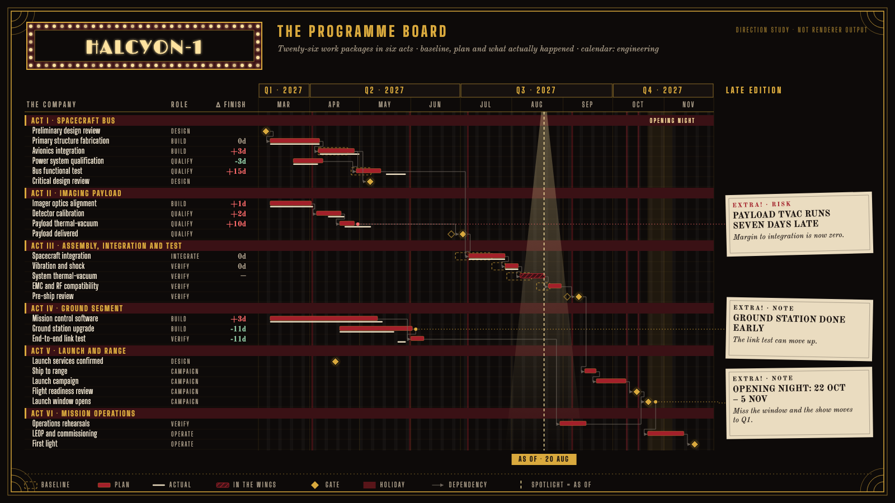

# HALCYON-1 target "Marquee": the programme board as a 1920s stage

A hand-drawn design target, approved by the product owner on 2026-09-26 as a second visual goal alongside target B (#453). It is **not** chrona output. The coordinates are written by hand in `marquee-board.html`, and text widths are estimated, not measured. It exists so that chrona's presentation vocabulary can be measured against a design decided outside the product.

The data is the same as target B: the HALCYON-1 programme board, 26 work packages in six groups, with baseline, plan and actual, dependencies, as-of 2027-08-20, three annotations and the launch window. It uses the same 1600 × 900 canvas, so the two targets can be compared row for row.

## What the direction is

The musical-stage world of 1920s Chicago: a stage-black ground, crimson velvet, marquee gold and bulb light, newsprint for what actually happened. No film logo, title treatment or character is used; only the period's stage and print vernacular.

| Stage element | Chart element | chrona role | Today |
| --- | --- | --- | --- |
| Marquee sign with a chasing bulb border | Title | title slot, `heading` role in Limelight | display face needs import or system resolution (#447); no border decoration for a slot |
| Marquee strip | Quarter tier of the axis | axis band tier: dark band, gold labels; month tier muted | tiers cannot differ (#426) |
| Playbill | Table: `THE COMPANY`, `ROLE`, `Δ FINISH` | table columns, letter-spaced uppercase headers | expressible (#410) |
| Acts I–VI | Group headers | group header band spanning table and timeline, `ACT n ·` prefix | no per-group prefix or tint (#453) |
| Velvet bars | Plan, baseline, actual | plan fill crimson; baseline dashed gold ghost; actual newsprint line; unobserved work hatched | expressible (#398, dash #423) |
| Gold stars of the show | Gates | gate diamond with glow; baseline gate hollow | shape expressible; glow is a treatment question |
| Spotlight | As-of | dashed line, a light cone widening to the floor, chip label `AS OF · 20 AUG` | no cone primitive; chip and bare label (#428) |
| Opening night | Launch window | named date-range band with its own label | no named ranges (#453) |
| Newspaper extras | Annotations | tilted clippings in a right-hand rail, row-aligned, dotted leaders from the mark | rail and row alignment (#453); no rotation |
| Ticket stub | Legend | horizontal legend with true swatches | square swatches only (#427) |

## What this target adds beyond B

B already asks for most of the structure. Marquee adds these requirements:

1. **A light cone for the as-of marker**: a gradient-filled polygon from the top of the plot to its foot, drawn beneath the marks.
2. **Rotated annotation boxes**, a small tilt per box, still aligned to their anchor row.
3. **A decorated title slot**: a border made of repeated elements, here bulbs.
4. **Three typeface families in one Theme**: display (Limelight), labels (Big Shoulders Display, designed for the City of Chicago), and notes (Old Standard TT). Each must be measured with its own face (#448) and available on a new user's machine (#447).
5. **A dark-first Theme** whose data marks meet a contrast floor against the surface they sit on, not only the canvas (#459).

## Regenerating the image

Open `marquee-board.html` in a browser. The slide is drawn into the SVG on the page. The PNG in this folder was produced with headless Chrome, at a 1600 × 900 window, from a copy of the page that shows only the slide:

    "Google Chrome" --headless=new --hide-scrollbars --window-size=1600,900 \
      --virtual-time-budget=8000 --screenshot=02-programme-board.png stage-only.html
