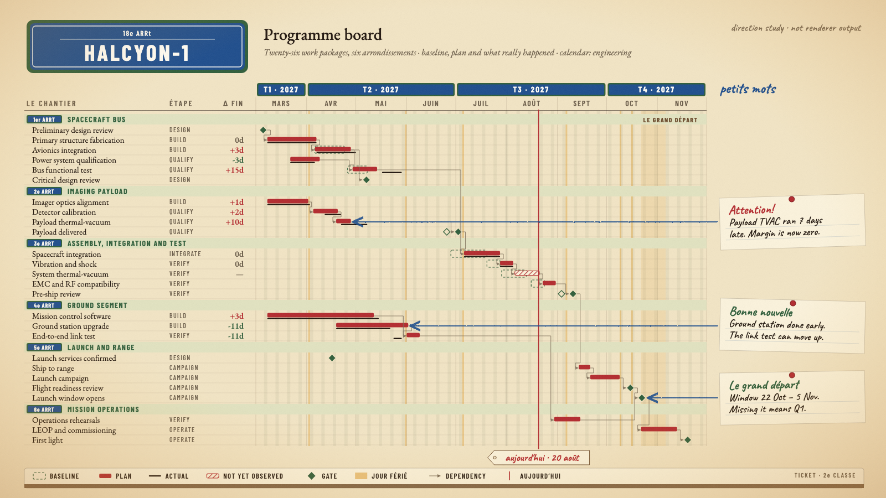

# HALCYON-1 target "Montmartre": the programme board in Paris light

A hand-drawn design target, approved by the product owner on 2026-09-26 as a third visual goal, alongside target B (#453) and the Marquee target (`../marquee-target-2026-09-26/`). It is **not** chrona output. The coordinates are written by hand in `montmartre-board.html`, and text widths are estimated, not measured.

The data and canvas are the same as target B and Marquee: the HALCYON-1 programme board, 26 work packages in six groups, baseline, plan and actual, dependencies, as-of 2027-08-20, three annotations and the launch window, on 1600 × 900. The three targets can be compared row for row.

## What the direction is

The warm, golden-graded Montmartre of early-2000s French cinema: cream paper under amber light, cherry red, bottle green, the enamel blue of Paris street signage, handwriting. No film logo, title treatment or character is used; only the city's vernacular and the period's colour grade.

Marquee is dark-first and theatrical. Montmartre is light, warm and handwritten. Together they bracket the range a preset catalogue (#429) has to support.

| Element | Chart element | chrona role | Today |
| --- | --- | --- | --- |
| Paris street plaque, green frame and blue enamel, `18e ARRt` header | Title | title slot drawn as a framed plaque | no framed or plaque treatment for a slot |
| Arrondissement plaques `1er ARRT` … `6e ARRT` | Group headers | group header band with a numbered plaque prefix | no per-group prefix or tint (#453) |
| French axis, `T1 · 2027`, `MARS … AOÛT` | Axis tiers | enamel quarter tier; month tier with French names | tier appearance (#426); French month names require a name table independent of locale (#432) |
| Ledger in EB Garamond: `LE CHANTIER`, `ÉTAPE`, `Δ FIN` | Table | table columns, letter-spaced uppercase headers | expressible (#410) |
| Cherry bars | Plan, baseline, actual | plan red, baseline dashed green ghost, actual ink line, unobserved work hatched | expressible (#398, dash #423) |
| Red thread and luggage tag, `aujourd'hui · 20 août` | As-of | thin red line with a hanging tag label | no tag shape; label chip and bare label (#428) |
| Le grand départ | Launch window | named, labelled date-range band | no named ranges (#453) |
| Pinned handwritten notes, blue chalk arrows | Annotations | tilted cards in a right-hand rail, row-aligned; the arrowhead points at the mark | rail, rotation, arrowhead at the subject (#453) |
| Métro ticket with a magnetic stripe | Legend | horizontal legend with true swatches | square swatches only (#427) |
| Vignette and film grain | Whole slide | a canvas texture and vignette treatment | nothing equivalent |

## What this target adds beyond B and Marquee

1. **Localized axis vocabulary chosen by the design, not by the host locale**: French month abbreviations and the trimester label `T`. This is #432 as a concrete acceptance case.
2. **A canvas treatment**: a warm vignette and film grain over the whole slide, drawn above everything and never intercepting content.
3. **Handwriting as a role**: notes and the as-of tag set in a script face, which must still be measured with its own metrics (#448).
4. **A shaped label**: the luggage tag, with a notch and an eyelet, rather than a rectangle.

## Regenerating the image

Open `montmartre-board.html` in a browser. The PNG in this folder was produced with headless Chrome, at a 1600 × 900 window, from a copy of the page that shows only the slide:

    "Google Chrome" --headless=new --hide-scrollbars --window-size=1600,900 \
      --virtual-time-budget=8000 --screenshot=02-programme-board.png stage-only.html
