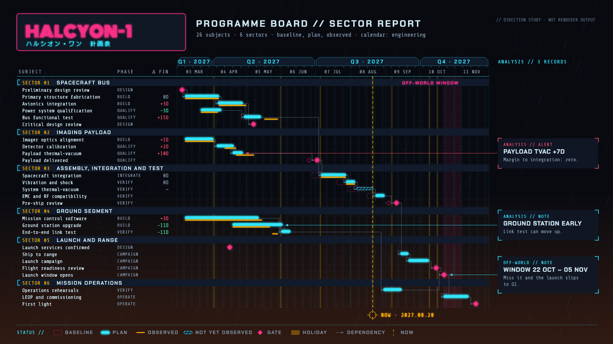

# HALCYON-1 target "Off-World": the programme board as a neon terminal readout

A hand-drawn design target, approved by the product owner on 2026-09-26 as a fourth visual goal, alongside target B (#453), Marquee (`../marquee-target-2026-09-26/`) and Montmartre (`../montmartre-target-2026-09-26/`). It is **not** chrona output. The coordinates are written by hand in `offworld-board.html`, and text widths are estimated, not measured.

The data and canvas are the same as the other targets: the HALCYON-1 programme board, 26 work packages in six groups, baseline, plan and actual, dependencies, as-of 2027-08-20, three annotations and the launch window, on 1600 × 900.

## What the direction is

The rain-soaked neon city of early-1980s science-fiction noir: a night ground under a smog-lit horizon, tube-light signage in two scripts, CRT terminals, HUD instrumentation. No film logo, title treatment or character is used; only the genre's visual vernacular.

Among the four targets, this is the one that leans hardest on **light itself**: glow, flicker, scanlines. It tests whether a Theme can express emission as well as paint.

| Element | Chart element | chrona role | Today |
| --- | --- | --- | --- |
| Magenta tube-light sign with a katakana subtitle | Title | title slot in a display face with glow, plus a second-script subtitle | glow would be a shadow treatment (`DropShadow` exists in Scene paint), untested for this; no subtitle slot |
| CRT terminal | Table | table set in a monospace face: `SUBJECT`, `PHASE`, `Δ FIN` | expressible with the packaged mono (#410) |
| Sectors 01–06 | Group headers | group header band with a `SECTOR nn` prefix and a bracket mark | no per-group prefix (#453) |
| HUD ruler | Axis | chamfered quarter tier, numbered month tier, week ticks | tier appearance (#426) |
| Neon tubes | Plan, baseline, actual | plan as a glowing cyan tube, baseline dashed magenta ghost, actual amber phosphor line, unobserved work hatched | shapes expressible (#398, dash #423); glow as above |
| Targeting reticle, `NOW · 2027.08.20` | As-of | dashed line with a reticle marker and a label | no reticle shape; label (#428) |
| Off-world window | Launch window | named, labelled date-range band with dashed edges | no named ranges (#453) |
| Analysis printouts | Annotations | bracketed terminal cards in a right-hand rail, row-aligned, leaders ending in an arrowhead at the mark, colour by kind | rail and row alignment (#453) |
| HUD status bar | Legend | horizontal legend with true swatches | square swatches only (#427) |
| Rain, scanlines, smog glow | Whole slide | canvas texture and a horizon gradient over the whole slide | nothing equivalent (also asked by Montmartre) |

## What this target adds beyond B, Marquee and Montmartre

1. **Emission as a treatment**: a glow around marks and text, distinct from a drop shadow, that stays within the slide and is measured as part of neither the mark nor the label.
2. **Two scripts in one title block**: Latin in a display face and Japanese in a dot-matrix face, each measured with its own metrics (#448).
3. **A reticle marker** for as-of, a composite of a ring and four ticks, anchored on the date.
4. **Chamfered axis cells**: a tier drawn as a shape with cut corners, not a rectangle.
5. **Canvas textures** again, this time rain and scanlines: the second target to ask for them, which makes the requirement general rather than a one-off.

## Regenerating the image

Open `offworld-board.html` in a browser. The PNG in this folder was produced with headless Chrome, at a 1600 × 900 window, from a copy of the page that shows only the slide:

    "Google Chrome" --headless=new --hide-scrollbars --window-size=1600,900 \
      --virtual-time-budget=8000 --screenshot=02-programme-board.png stage-only.html
