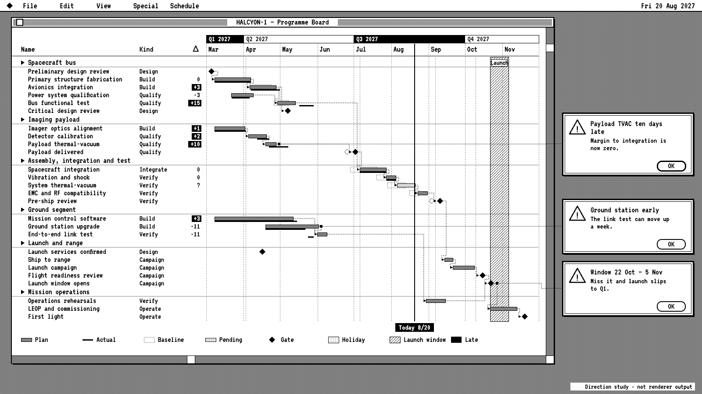

# HALCYON-1 target "One Bit": the programme board on a one-bit desktop

A hand-drawn design target, approved by the product owner on 2026-09-26 as one of seven added together (Swiss Grid, Blueprint, Transit Map, Pixel Quest, Pastel Symmetry, One Bit, Flat Pack), alongside target B (#453) and the earlier targets in sibling folders under `docs/research/presentation/`. It is **not** chrona output. The coordinates are written by hand in `onebit-board.html`, and text widths are estimated, not measured.

The data and canvas are the same as the other targets: the HALCYON-1 programme board, 26 work packages in six groups, baseline, plan and actual, dependencies, as-of 2027-08-20, three annotations and the launch window, on 1600 × 900.

## What the direction is

A 1984 desktop in one bit: black and white only, every grey made by ordered dithering, a striped title bar, a menu bar with the date, and each note as an alert box. No operating system's logo, icons or fonts are used.

The point is practical: it proves a Theme can carry the whole chart without a single colour, which is what print, fax and e-ink presets need (`print-mono` today uses greys).

| Element | Chart element | chrona role | Today |
| --- | --- | --- | --- |
| Black and white only | Paint | two paints; every tint a dither pattern | patterns: outline and diagonal hatch only |
| 12.5 / 25 / 50 % dithers | Holidays, pending, plan | ordered-dither patterns as named Theme paints | no ordered-dither pattern |
| Inverted `+15` cells and `Today 8/20` | Late values, as-of label | white on black blocks | label chip (#428); no per-cell fill |
| Window chrome, menu bar | Slots, header | striped title bar, scroll bars, menu strip with date | no slot frame; no header strip |
| Alert boxes with caution icon and OK button | Annotations | dialog-styled cards | #465 |
| Launch window as diagonal lines | Named range | line pattern fill | no named ranges (#453) |

## What this target adds beyond the others

1. **An ordered-dither pattern family** as Theme paints, so a strictly two-colour output can still show five levels.
2. **Per-cell inversion** for late values.
3. A reference for a true one-bit preset, beyond today's greyscale `print-mono`.

## Regenerating the image

Open `onebit-board.html` in a browser. The PNG in this folder was produced with headless Chrome, at a 1600 × 900 window, from a copy of the page that shows only the slide:

    "Google Chrome" --headless=new --hide-scrollbars --window-size=1600,900 \
      --virtual-time-budget=12000 --screenshot=02-programme-board.png stage-only.html
