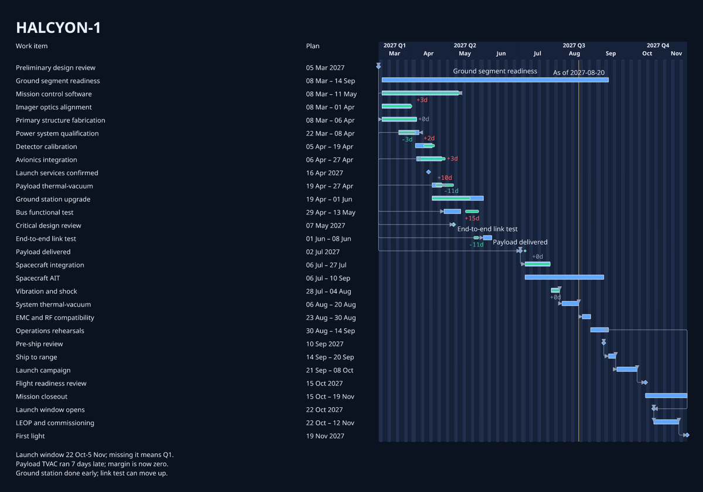
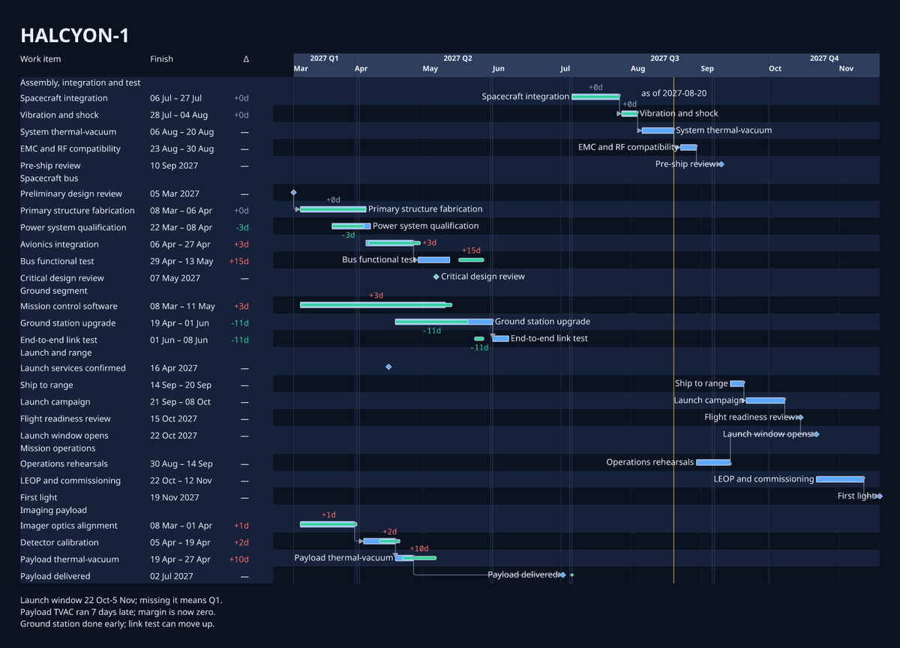
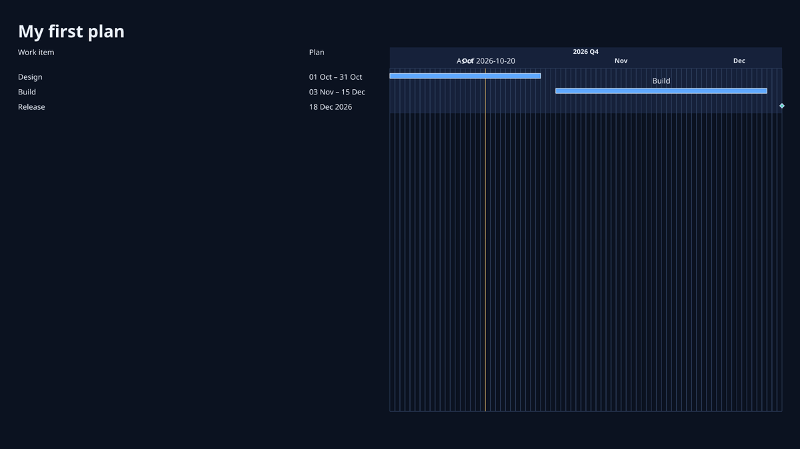
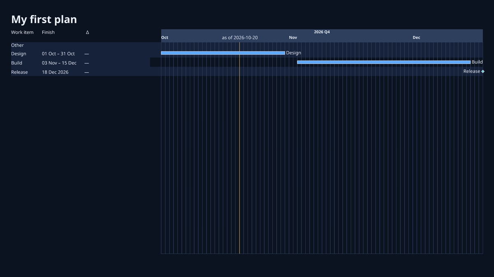

# Preset tuning: `control-room-dark`

Before and after for the `control-room-dark` catalogue preset. The change is YAML only. Before, this preset shared the generic `chrona-default-draft` View **and** the `briefing` Theme and Layout with `mission-light`; only its colour scheme differed. It now has its own members under `src/chrona/resources/presets/bundles/control-room-dark/`. No code changed, and no committed corpus evidence changed.

The structure is the same as the tuned `mission-light` (PR #471): the same View changes and the same Layout, with the corpus `control-room-dark` colour scheme on top. The two presets now differ only by scheme, which is honest for a light/dark pair. The members are separate copies so each can be tuned on its own later.

## HALCYON-1 (26 items, with actuals)

| before | after |
| --- | --- |
|  |  |

## `chrona init` starter (3 items)

| before | after |
| --- | --- |
|  |  |

## What changed

The same as `mission-light` (see its README), plus:

| Member | Change | Vocabulary used |
| --- | --- | --- |
| Theme | dependency lines start with a small circle instead of an arrowhead | a `marker` token with `shape: circle` bound to `relationSourceTerminal` |
| View | no missing-actual marks (see observations) | `comparison.facets` without `missingActual` |

HALCYON-1 renders with no warnings at 1600 × 900. The starter keeps its one pre-existing as-of label warning.

## Where YAML ran out

1. **Colour by team is not project-generic.** Colouring bars by `owner` needs the concrete values twice: in the View's `colorEncoding.domain`, and in the Theme's `colorScales.<scale>.slots`. A catalogue preset cannot know them, so every team is the same blue. It needs a categorical palette assigned to values in order of first appearance.
2. **Row stripes and group backgrounds do not combine in the timeline.** With `rows: alternate, groups: all`, the group band paints over the stripes in the timeline, so stripes stop at the table's edge. With `groups: none`, the stripes cross the timeline, but the group header band disappears and each header merges into the stripe of the row above it.
3. **With `groups: alternate`, each group header sits inside the previous group's band.** The band starts below the header, so the header reads as the last row of the group before it. This is misleading, not just cosmetic.
4. **The Theme's `groupHeader` role does not reach the header text.** The Theme declares `groupHeader.fontWeight: weight.bold`, but the Scene paints `group-header:*` text with the body `text` role at weight 400. Headers cannot be made bold, so a dark table has little to separate them from rows.

## Observations

- **Missing-actual marks appear on work that is not due yet.** With `missingActual` in the facets, every item without an observation gets a hollow capsule at its bar end, including items planned to finish after the as-of date. Those are not missing; they are in the future. The preset leaves the facet out; the mark should only apply to items whose planned finish is on or before as-of.
- **Dependency lines start with an arrowhead by default.** In 10 of the 11 shipped Themes, `relationSourceTerminal` is bound to the same filled triangle as the target end: `briefing`, which the bare `chrona render` default uses, plus `print`, `wallboard`, `elevated-light` and the other corpus themes. Only `controller-z/executive-light` uses a circle. A small circle or no mark at the source is the common convention; an arrowhead at both ends reads as a two-way relation.

## Update: row guides and a visible axis boundary

Added after review feedback. On a wide timeline, a bar on the right could only be matched to its task by following the row back to the table, and the axis blended into the plot.

| Member | Change | Vocabulary used |
| --- | --- | --- |
| View + Layout | alternating row stripes run from the table to the timeline's right edge; group bands are kept to the table | `backgroundDecoration.rows: alternate`, `backgroundExtents.rowBand: both, groupBand: table` |
| View | each bar is labelled with its name at its end, in its own row, as well as in the table | `visibility.labels.placement: plot, side: end`, fallback `[end, start, suppress]` |
| Theme | the axis band is painted in `neutral` at full opacity, not the group-band colour, so the axis ends visibly where the plot begins | `colorBindings.axis-band-decoration.fill`, `roles.axis-band-decoration.opacity` |

HALCYON-1 still renders with no warnings. The limits met while doing this are recorded in the `executive-light` README (items 2 and 4–6) and in #470: no axis baseline rule, labels not avoiding dependency lines, suppressed labels leaving no trace, and plot-and-table labels not being a declared choice.
