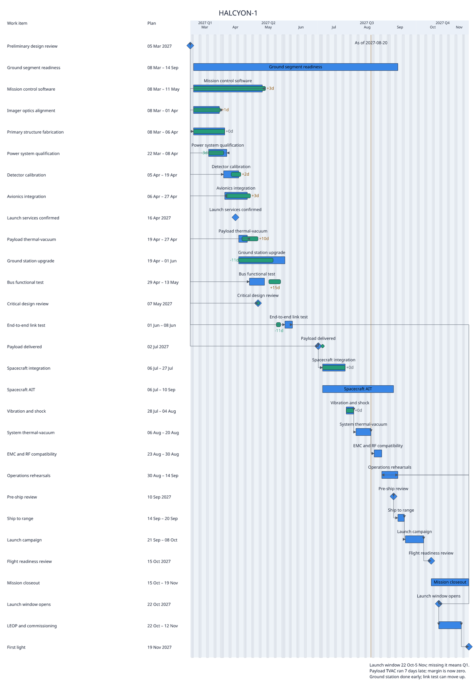
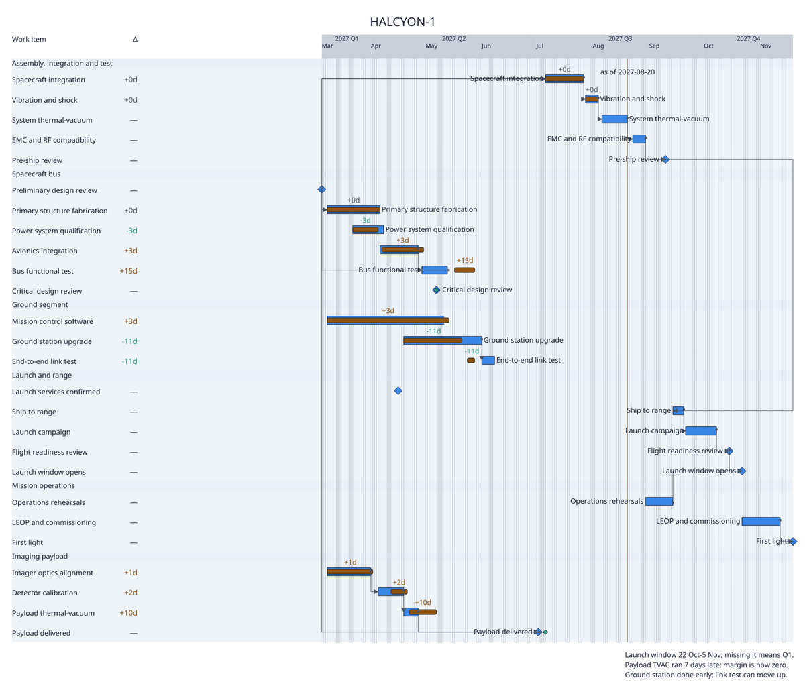
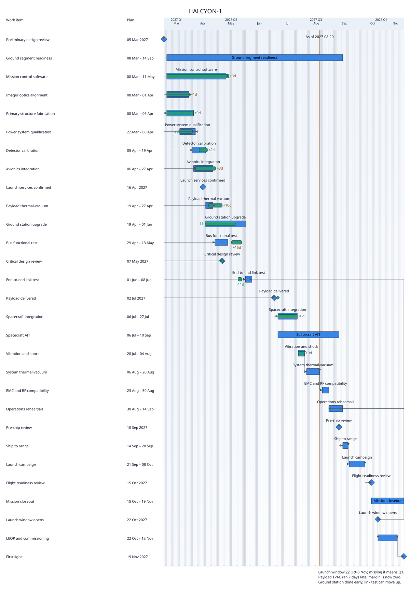
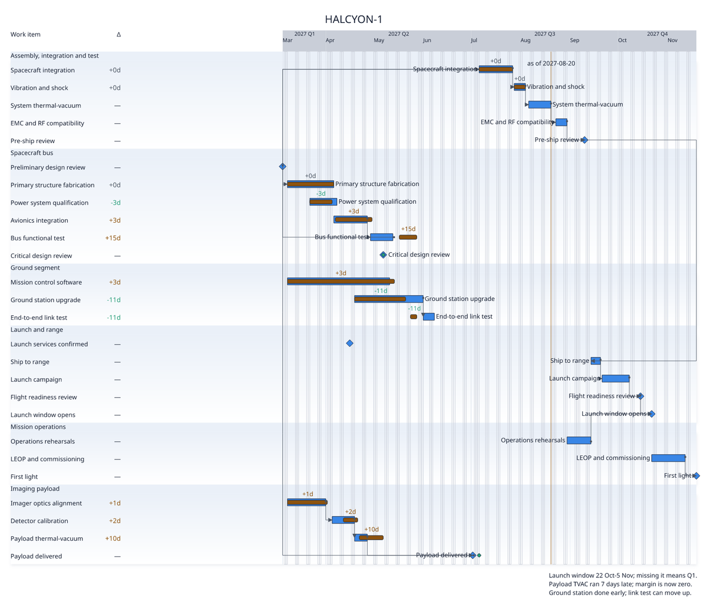
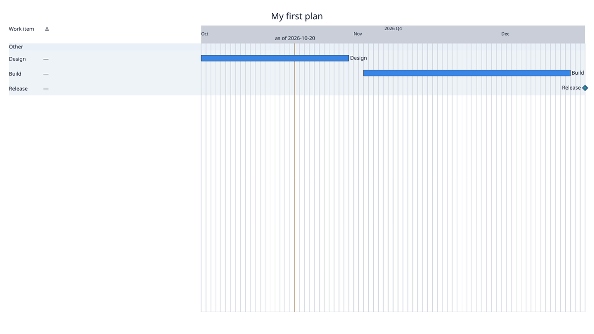

# Preset tuning: `elevated-light`

Before and after for the `elevated-light` catalogue preset. The change is YAML only. Before, the preset used the generic `chrona-default-draft` View with Controller Z's `elevated-light` Theme and `executive-review` Layout: 72 px rows and 24 px marks, 1600 × 2304 on a 26-item project. It now has its own View, Theme and Layout under `src/chrona/resources/presets/bundles/elevated-light/`. No code changed, and no committed corpus evidence changed.

**What makes this preset "elevated" is one treatment: a gradient and drop shadow on group bands.** Everything else is `executive-light`. That treatment is only painted under a visual profile that supports it, so the images below show both the default profile and `v0.7`.

## HALCYON-1, default visual profile (what `chrona render --preset` gives)

| before (1600 × 2304) | after (1600 × 1376) |
| --- | --- |
|  |  |

## HALCYON-1, `--visual-profile chrona-output/visual/v0.7-png`

| before | after |
| --- | --- |
|  |  |

## `chrona init` starter

| before | after |
| --- | --- |
|  |  |

## What changed

| Member | Change | Vocabulary used |
| --- | --- | --- |
| View | the tuned `executive-light` View: sparse table (work item, Δ), progress fill, names at the bar end in their own row | existing View vocabulary |
| View + Layout | **group cards across the whole width** instead of row stripes: group bands span table and timeline (`groupBand: both`), so the elevated treatment is visible where the bars are, and each group reads as one card to the timeline's right edge | `backgroundDecoration.groups: all`, `backgroundExtents.groupBand: both` |
| Theme | rows 40 px and marks 16 px (were 72 and 24); a `numeric` role for Δ; circle source terminals; the axis band in `neutral` | as in `executive-light` |
| Theme | gradient turned from 35° to **90°**, top to bottom, so each group card fades downwards instead of disappearing towards the right; shadow opacity 0.28 → 0.4 and y-offset 2 → 3 px | `elevated.gradient-angle`, `elevated.shadow-opacity`, `elevated.shadow-offset-y` |

HALCYON-1: no CLI warnings or layout failures under either profile. Its Scene still records `W_LAYOUT_ACTUAL_INCOMPLETE:tvac` and one declared `W_LAYOUT_LABEL_SUPPRESSED` outcome. The starter keeps its one pre-existing as-of label warning.

## Where YAML ran out

1. **A preset cannot choose its visual profile, so its defining treatment is silently dropped.** `elevated-light`'s gradient and shadow are declared with `fidelity: decorative-optional`. Under the default visual profile, which is what `chrona preset copy elevated-light` followed by `chrona render --preset` uses, they are removed with **no diagnostic**. The preset then looks identical to `executive-light`. The user must know to pass `--visual-profile chrona-output/visual/v0.7-png`. A preset should be able to declare the profile it was designed for, or the render should say that decoration was dropped.
2. **Shadows and gradients on marks are silently ignored.** Adding `shadowOffsetX/Y`, `shadowBlur`, `shadowOpacity` and a `shadowColor` binding to the `planned` role renders without error and without any shadow: the Scene's paint for `planned:*` has none. Either the treatment should apply to marks, or declaring it on a role that cannot carry it should be diagnosed.
3. **Group-card treatments and row stripes exclude each other in the timeline.** This is the same limit as in `control-room-dark`: the group band covers row stripes. This preset chooses group cards; the other four choose stripes.
