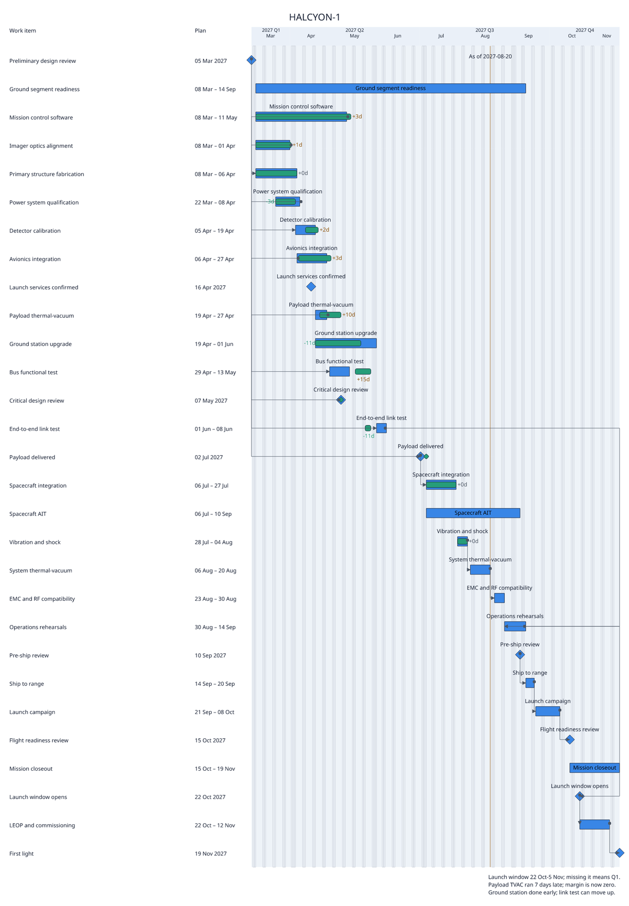
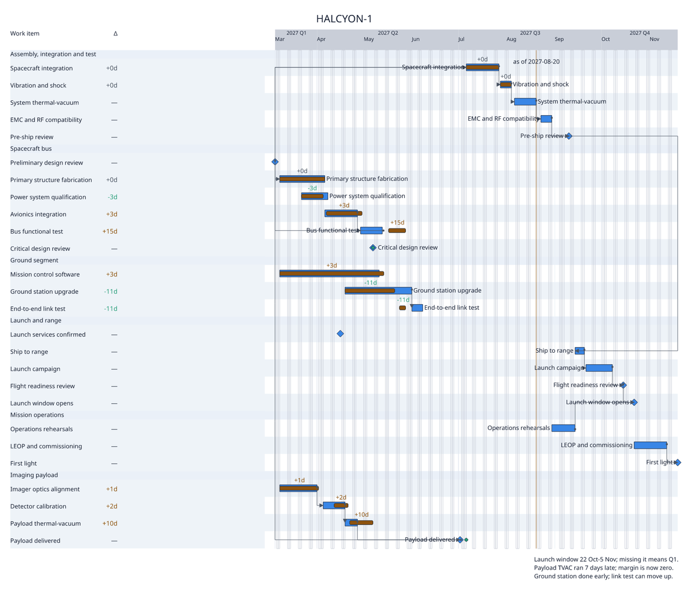
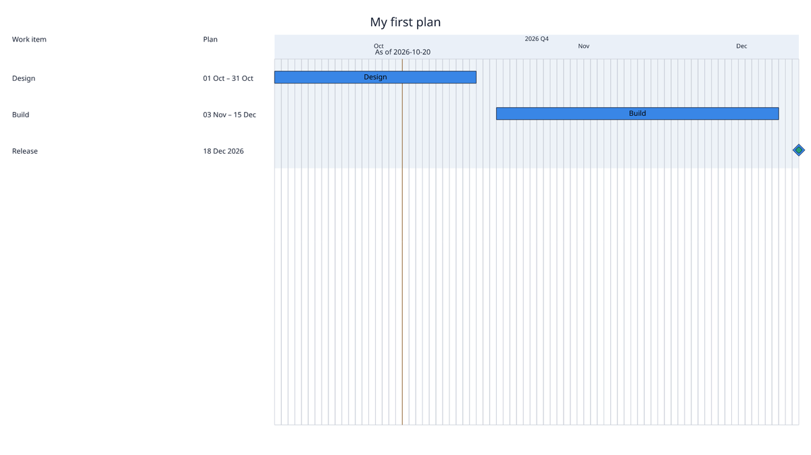
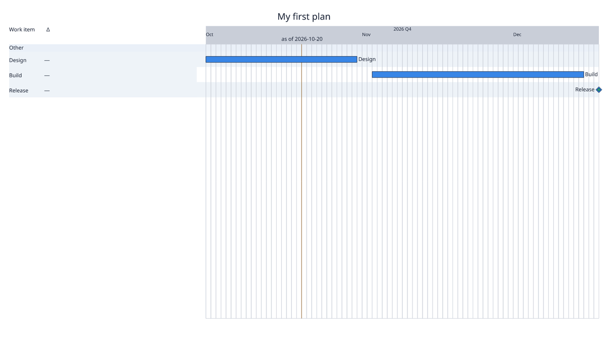

# Preset tuning: `executive-light`

Before and after for the `executive-light` catalogue preset. The change is YAML only. Before, the preset used the generic `chrona-default-draft` View with the Theme, scheme and Layout of the Controller Z corpus. That Theme was sized for a handful of workstreams: 72 px rows and 24 px marks. On a 26-item project, the image was 1600 × 2304. The preset now has its own View, Theme and Layout under `src/chrona/resources/presets/bundles/executive-light/`. No code changed, and no committed corpus evidence changed.

## HALCYON-1 (26 items, with actuals)

| before (1600 × 2304) | after (1600 × 1376) |
| --- | --- |
|  |  |

## `chrona init` starter (3 items)

| before | after |
| --- | --- |
|  |  |

## What changed

| Member | Change | Vocabulary used |
| --- | --- | --- |
| View | the tuned `mission-light` structure, kept deliberately sparse for an executive audience: the table has only the work item and its finish delta; progress fill from actuals | existing View vocabulary |
| View + Layout | **row guides across the whole plot**: alternating row stripes run from the table to the timeline's right edge (group bands stay in the table), and each bar is labelled with its name at its end, in its own row. On a wide timeline, a bar on the right can be matched to its task without following the row back to the table | `backgroundDecoration.rows: alternate`, `backgroundExtents.rowBand: both, groupBand: table`, `visibility.labels.placement: plot, side: end`, fallback `[end, start, suppress]` |
| Theme | rows 40 px and marks 16 px (were 72 and 24) | `timeline-row-height`, `timeline-mark-size` |
| Theme | add the `numeric` role the delta column needs: the Controller Z Theme never had a numeric column | `roles.numeric` |
| Theme | dependency lines start with a small circle | `relationSourceTerminal` |
| Theme | the axis band is painted in `neutral` at full opacity instead of `surfaceRaised` at the group-band opacity, so the axis is visibly separate from the plot | `colorBindings.axis-band-decoration.fill`, `roles.axis-band-decoration.opacity` |
| Layout | the Controller Z executive Layout, unchanged except its id | — |

HALCYON-1: no warnings. The starter keeps its one pre-existing as-of label warning.

## Where YAML ran out

1. **No legend from a preset.** Legend entries such as `{role: planned, label: Planned}`, milestone lists and group details come from a separate **Review Detail Profile** (`--detail`). A catalogue preset has four members: View, Theme, colour scheme and Layout. It cannot carry one. The executive Layout still reserves `legend`, `milestones`, `observations` and `group-details` footer slots (180 × 17–20 px each), which render empty.
2. **The axis has no boundary of its own.** Axis tiers have four roles: `band`, `labels`, `grid-major` and `grid-minor`. None draws a rule between the axis and the plot. The band's default colour is `surfaceRaised`, the same colour as the group bands, in every shipped Theme. By default, the axis therefore blends into the plot, and where it ends is ambiguous. The preset works around it with a distinct band colour. The default should be clear without that: a baseline rule under the axis, and an axis band that differs from group bands.
3. **A missing Theme role is reported without its name.** `chrona render` failed with `E_THEME_ROLE_REQUIRED` and `sourceRef: "/"`. The pointer `/body/roles/numeric/fontFamily` exists on the `ThemeTokenError` but is dropped before the CLI diagnostic. This is the second case, after `E_THEME_METRIC_REQUIRED` in `mission-light`.
4. **Labels are not placed against dependency lines.** With plot labels at the bar end, several names are drawn over dependency lines, for example `Bus functional test` and `Spacecraft integration`. Relations are not obstacles for label placement. The shared obstacle inventory from #466 is the fix.
5. **Suppressed labels leave no trace on the slide.** 7 of 26 plot labels are suppressed where neither end nor start fits, silently by `overflow: suppress`. The names remain in the table, so nothing is lost, but the plot does not show which rows lack a label.
6. **Label placement is one of `plot`, `table` or `none`.** "Both" works only because the table's title column is independent of label placement. It is not a declared choice.
