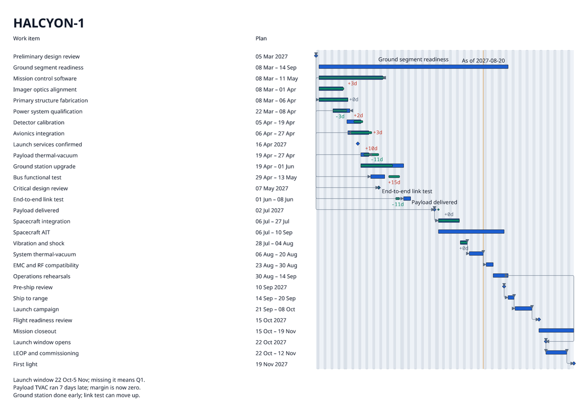
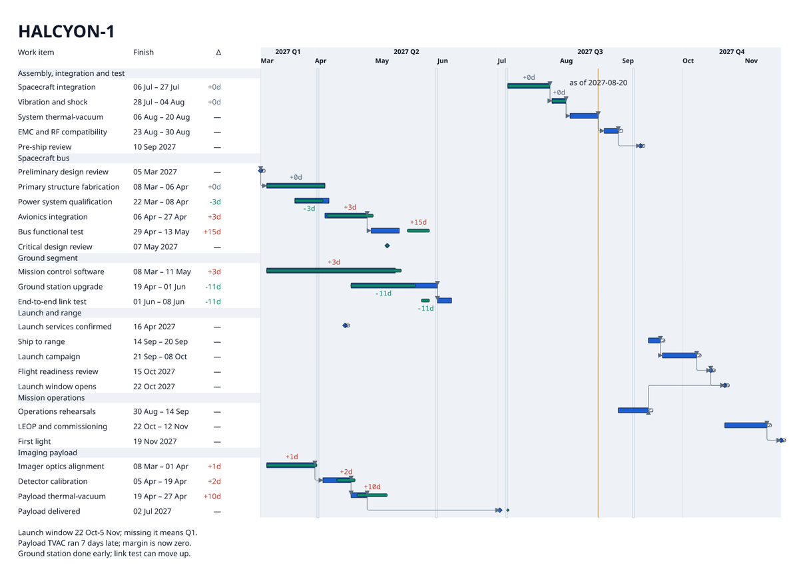
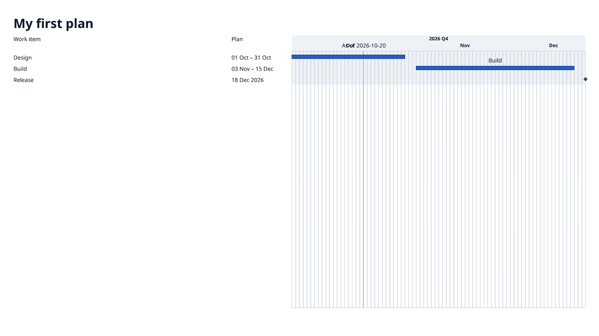
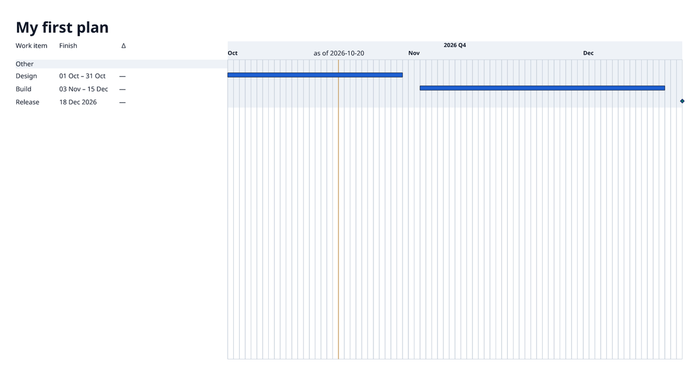

# Preset tuning: `mission-light`

Before and after for the `mission-light` catalogue preset. The change is YAML only: the preset now has its own View, Theme and Layout Profile under `src/chrona/resources/presets/bundles/mission-light/`, instead of sharing the generic `chrona-default-draft` View and the corpus `briefing` Theme and Layout with four other presets. No code changed, and no committed corpus evidence changed.

## HALCYON-1 (26 items, with actuals)

| before | after |
| --- | --- |
|  |  |

## `chrona init` starter (3 items)

| before | after |
| --- | --- |
|  |  |

## What changed

| Member | Change | Vocabulary used (all existing) |
| --- | --- | --- |
| View | group by the `owner` field when present, `Other` otherwise, as header rows | `grouping.by: field`, `presentation: header` |
| View | leave rollup `group` objects out of the rows; they duplicated their children as long bars | `selection.exclude.objectTypes` |
| View | quarter band, quarter and month labels, month gridlines | `axis.tiers` |
| View | as-of marker, non-working-day shading | `markers`, `shading` |
| View | table: work item, planned range, signed finish delta | `tableColumns`, `finishDelta` |
| View | work item names in the table, not over the bars | `visibility.labels.placement: table` |
| Theme | add the group-header height and closed-day width metrics that header grouping requires | `timeline.groupHeader.blockSize`, `timeline.calendarClosed.minimumDayWidth` |
| Layout | table sized to its content, timeline takes the rest (was 5 : 6) | slot `inlineSize` |

HALCYON-1 renders with no warnings at 1600 × 900. The starter keeps one warning it already had (`W_LAYOUT_LABEL_OVERFLOW` on the as-of label).

## Where YAML ran out

These were tried and backed out, or could not be expressed. They are mechanism gaps, not tuning:

1. **Group order.** `grouping.order` takes an explicit list of values only. A project-generic preset cannot know the values, so groups come out alphabetically (`Assembly…` before `Spacecraft bus`). It needs an order such as "by earliest planned start".
2. **Axis label thinning is uniform.** With `overflow: thin-with-record`, one colliding label at the window's edge removed every second month label (April, June, August, October), although those had room.
3. **A window margin creates a sliver month.** `window: {mode: selected-planned, marginDays: 7}` adds a few days of the previous month; its label collides with the next month's.
4. **One `Other` header when nothing is grouped.** On a project with no `owner` field at all, the whole table sits under a single `Other` header. Header grouping should be omitted when every item falls in the missing group.
5. **The CLI hides which metric is missing.** Before the Theme was extended, the render failed with `E_THEME_METRIC_REQUIRED` and `sourceRef: "/"`. Layout knows the pointer (`/body/metrics/timeline.groupHeader.blockSize`), but the diagnostic drops it.

Not attempted in this step: a legend for plan, actual and baseline, and removing the duplicate finish-delta labels in the plot.
