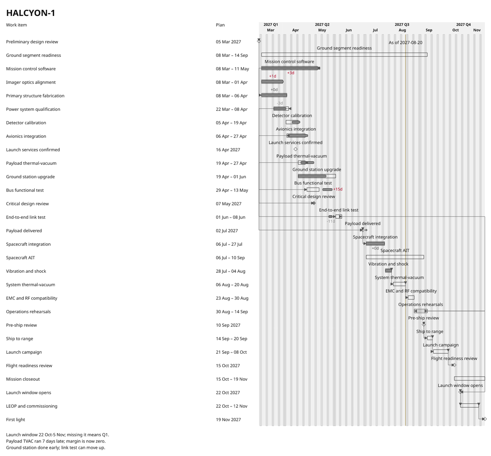
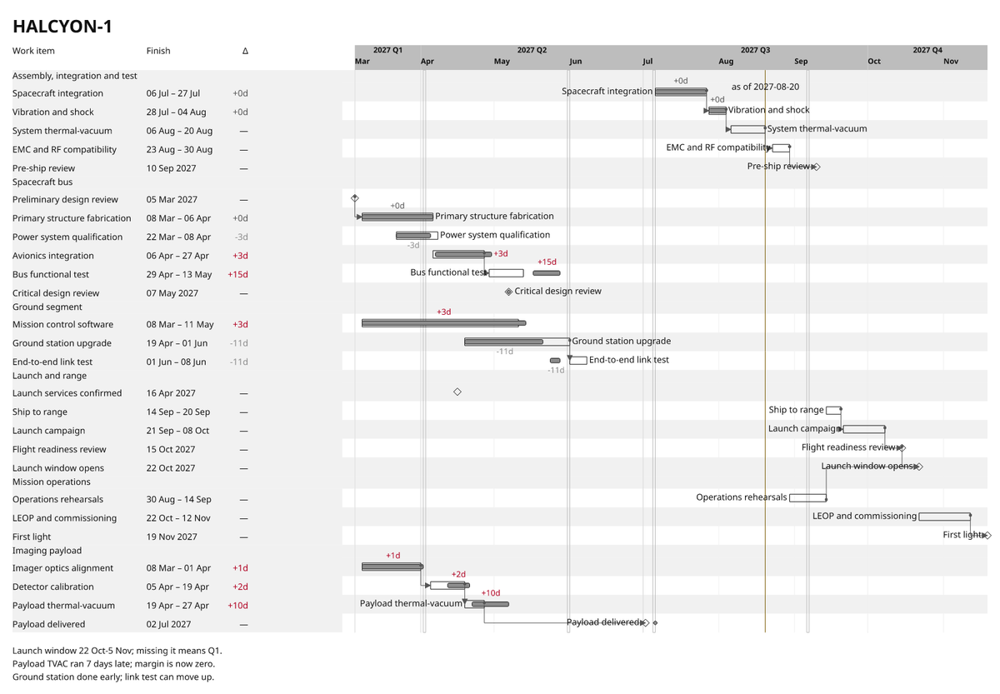
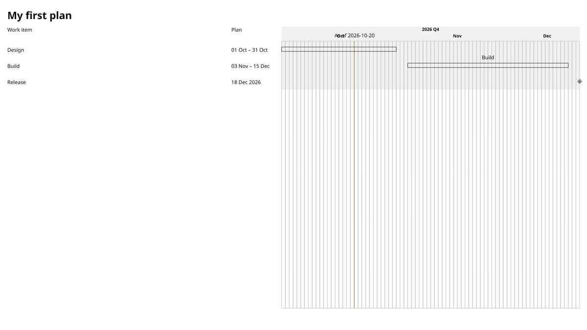
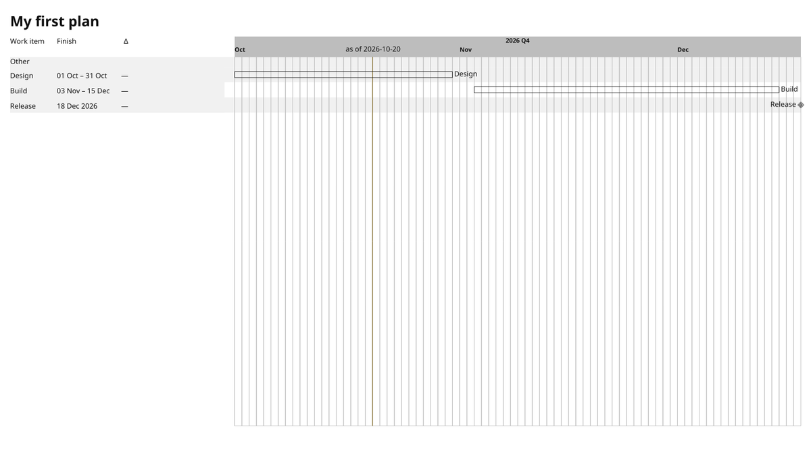

# Preset tuning: `print-mono`

Before and after for the `print-mono` catalogue preset. The change is YAML only. Before, the preset used the generic `chrona-default-draft` View and the corpus `print` Theme; only its Layout lived in `presets/bundles/print-mono/`. It now has its own View and Theme there too, and its Layout is adjusted. No code changed, and no committed corpus evidence changed.

## HALCYON-1 (26 items, with actuals)

| before | after |
| --- | --- |
|  |  |

## `chrona init` starter (3 items)

| before | after |
| --- | --- |
|  |  |

## What changed

| Member | Change | Vocabulary used |
| --- | --- | --- |
| View | the same structure as the tuned `mission-light`: header grouping by `owner`, quarter and month tiers, as-of, closed-day shading, planned range and finish delta columns, rollups excluded, names in the table, no missing-actual marks | existing View vocabulary |
| Theme | group-header height and closed-day width metrics that header grouping requires | `timeline.groupHeader.blockSize`, `timeline.calendarClosed.minimumDayWidth` |
| Theme | dependency lines start with a small circle | a `marker` token with `shape: circle` on `relationSourceTerminal` |
| Theme | rows 30 px with 4 px padding (were 44 and 8): the densest that still fits one line of 14 px text at 1.5 leading | `timeline-row-height`, `timeline-row-padding` |
| Layout | the table takes at least its content and shares the rest 1 : 3 with the timeline (was 5 : 6) | slot `inlineSize` |

HALCYON-1: 1600 × 1111 from a requested 1600 × 900, with no CLI warnings or layout failures (before: 1600 × 1487). Its Scene still records `W_LAYOUT_ACTUAL_INCOMPLETE:tvac` and one declared `W_LAYOUT_LABEL_SUPPRESSED` outcome. The starter keeps its one pre-existing as-of label warning.

## Where YAML ran out

1. **A content-sized table is 1 px too narrow for its own delta column.** With the table slot at `inlineSize: content`, the `Δ` column gets 45.55 px but needs 46.63 px: `W_LAYOUT_VISIBLE_OVERFLOW` on `column:Δ`. The slot's content measure and the column's content measure disagree. Changing the column to `minmax: {min: content, max: {fr: 1}}` does not help, because a content-sized slot has no slack. The preset works around it by giving the table slot `minmax: {min: content, max: {fr: 1}}`. `mission-light` at the same setting does not hit it, so it depends on the Theme's type sizes.
2. **Row height is not derived from the text.** A row of 26 px with 6 px padding produced 79 `W_LAYOUT_VISIBLE_OVERFLOW` and 5 `W_SCENE_TEXT_INTERSECTION`, one per table cell, because 14 px × 1.5 + 2 × 6 = 33 px. The Theme has to do this arithmetic by hand. A row metric of "one text line plus padding" would make density a single choice.

## Observations

- **`print-mono` is not monochrome.** Its colour scheme (`examples/halcyon-1/schemes/print-mono.yaml`, shared with the corpus) paints slips in `negative: #B00020`, which is red, and the as-of line in `warning: #7A5A00`, which is olive. On a monochrome printer, both collapse to mid-grey. A print preset needs another cue for slips, for example weight or a sign glyph. The scheme is shared with committed corpus slides, so this PR leaves it alone.
- The two observations from `mission-light` and `control-room-dark` apply here as well: missing-actual marks on work not yet due, and arrowhead source terminals by default. This preset avoids both.

## Update: row guides and a visible axis boundary

Added after review feedback. On a wide timeline, a bar on the right could only be matched to its task by following the row back to the table, and the axis blended into the plot.

| Member | Change | Vocabulary used |
| --- | --- | --- |
| View + Layout | alternating row stripes run from the table to the timeline's right edge; group bands are kept to the table | `backgroundDecoration.rows: alternate`, `backgroundExtents.rowBand: both, groupBand: table` |
| View | each bar is labelled with its name at its end, in its own row, as well as in the table | `visibility.labels.placement: plot, side: end`, fallback `[end, start, suppress]` |
| Theme | the axis band is painted in `neutral` at full opacity, not the group-band colour, so the axis ends visibly where the plot begins | `colorBindings.axis-band-decoration.fill`, `roles.axis-band-decoration.opacity` |

HALCYON-1 still renders without layout failures. The limits met while doing this are recorded in the `executive-light` README (items 2 and 4–6) and in #470: no axis baseline rule, labels not avoiding dependency lines, suppressed labels leaving no trace, and plot-and-table labels not being a declared choice.
