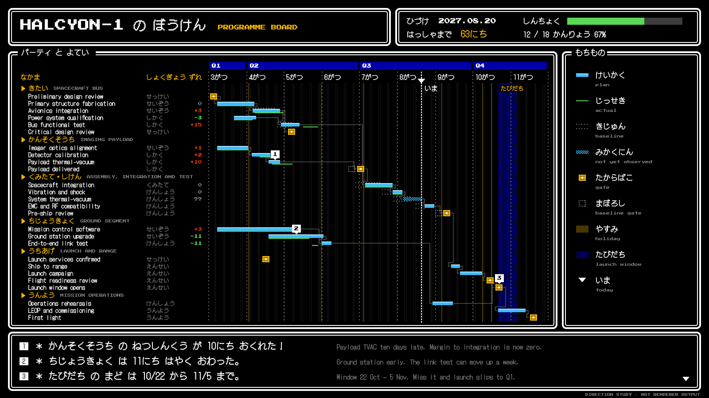

# HALCYON-1 target "Pixel Quest": the programme board as a retro role-playing game

A hand-drawn design target, approved by the product owner on 2026-09-26 as one of seven added together (Swiss Grid, Blueprint, Transit Map, Pixel Quest, Pastel Symmetry, One Bit, Flat Pack), alongside target B (#453) and the earlier targets in sibling folders under `docs/research/presentation/`. It is **not** chrona output. The coordinates are written by hand in `rpg-board.html`, and text widths are estimated, not measured.

The data and canvas are the same as the other targets: the HALCYON-1 programme board, 26 work packages in six groups, baseline, plan and actual, dependencies, as-of 2027-08-20, three annotations and the launch window, on 1600 × 900.

## What the direction is

The screen of a 1980s console role-playing game: black ground, double-bordered round-cornered windows, pixel type in Latin and kana, a party list for the table, treasure chests for gates, a status window, and a message window at the bottom. No game's logo, characters, sprites or music are used.

| Element | Chart element | chrona role | Today |
| --- | --- | --- | --- |
| Windows with titles | Slots | each slot framed as a titled window | no slot frame treatment |
| 2 px grid, crisp edges | All geometry | snap to a pixel grid; no anti-aliasing | no snapping treatment |
| `Press Start 2P` + `DotGothic16` | Type | bitmap-style faces, measured at their own metrics | per-face measurement (#448); availability (#447) |
| Status window: date, days to launch, progress gauge `12 / 18` | Header figures | derived figures and a gauge | no derived figures |
| Treasure chests | Gates | sprite by rule, ghost sprite for baseline | #464 |
| Message window with ①②③ | Annotations | notes collected into a bottom window, numbered markers at marks | numbered marker exists; bottom slot (#466) |
| Item window | Legend | legend as a sprite list in its own window | legend layout (#427) |
| Kana months `3がつ`, jobs `せっけい` | Axis, table | vocabulary chosen by the design | #432 |

## What this target adds beyond the others

1. **Pixel snapping** as a Layout or Scene treatment.
2. **A progress gauge** derived from observations: share of work packages finished by as-of.
3. **A bottom message slot** for notes, as a placement region (#466).

## Regenerating the image

Open `rpg-board.html` in a browser. The PNG in this folder was produced with headless Chrome, at a 1600 × 900 window, from a copy of the page that shows only the slide:

    "Google Chrome" --headless=new --hide-scrollbars --window-size=1600,900 \
      --virtual-time-budget=12000 --screenshot=02-programme-board.png stage-only.html
