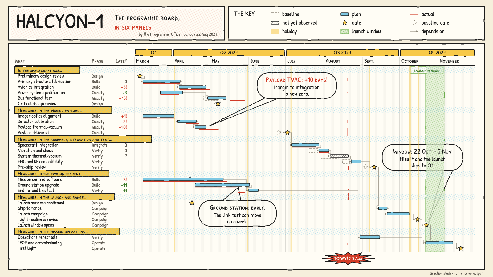

# HALCYON-1 target "Sunday Strip": the programme board as a newspaper comic

A hand-drawn design target, approved by the product owner on 2026-09-26 as an eighth visual goal, alongside target B (#453), Marquee, Montmartre, Off-World, Tenth Frame, Yuya and Title Card (sibling folders under `docs/research/presentation/`). It is **not** chrona output. The coordinates, including where each speech balloon sits, are written by hand in `sunday-board.html`, and text widths are estimated, not measured.

The data and canvas are the same as the other targets: the HALCYON-1 programme board, 26 work packages in six groups, baseline, plan and actual, dependencies, as-of 2027-08-20, three annotations and the launch window, on 1600 × 900.

## What the direction is

A mid-century Sunday newspaper comic: inked panels on newsprint, hand lettering, four flat inks, Ben-Day dots, narrative captions and speech balloons. No strip title, character, prop or signature pattern from any published comic is used; only the medium's grammar.

It is the first target whose annotations are **not in a rail**. Every other target lines its notes up at the right edge; here each note is a speech balloon placed in free space inside the plot, next to the work it talks about.

| Element | Chart element | chrona role | Today |
| --- | --- | --- | --- |
| Inked panels: title, key, chart | Slide regions | slots drawn as bordered panels with a gutter between them | no slot border treatment; no gutter |
| Hand-inked line | Mark and panel outlines | every mark outlined in ink, with a slight hand wobble | stroke yes; no wobble treatment |
| Speech balloons | Annotations | placed **inside the plot** in free space near their subject, with a tail to the mark | annotations go to a rail (#453); no in-plot placement; no balloon shape (#465 covers images behind a note, not placement) |
| `In the …` / `Meanwhile, in the …` | Group headers | yellow caption box; the text is composed from a phrase and the group title | no composed header text; no caption box |
| Ben-Day dots | Group bands, launch window | halftone dot pattern | patterns: outline and diagonal hatch only |
| Stars | Gates | every gate a star by rule; the baseline gate its dashed outline | #464 |
| `TODAY! 20 Aug` burst | As-of | as-of label inside a starburst | label chip only (#428) |
| `+10!`, `?` | Δ column | slip values with an exclamation, a missing actual as `?` | no per-value text affixes by state |
| Bars | Plan, baseline, actual | flat sky-blue plan outlined in ink, dashed baseline, red actual | expressible (#398, dash #423) |
| The key panel | Legend | legend in its own panel, three columns | square swatches only; vertical stack (#427) |

## What this target adds beyond the others

1. **In-plot annotation placement**: find free space near the subject, avoid marks, labels and dependency lines, and draw a tail to the subject. The mock places its balloons by hand, and the first balloon still hides one dependency line; an automatic placement must treat dependency lines as obstacles too.
2. **Composed header text**: a group header built from a phrase plus the group title, with the first group phrased differently from the rest.
3. **A halftone dot pattern** as a paint.
4. **A hand-wobble line treatment** that changes stroke geometry but not bounds.
5. **Panels**: the slide's regions drawn as inked panels with gutters, so the legend lives in its own panel beside the title.

## Regenerating the image

Open `sunday-board.html` in a browser. The PNG in this folder was produced with headless Chrome, at a 1600 × 900 window, from a copy of the page that shows only the slide:

    "Google Chrome" --headless=new --hide-scrollbars --window-size=1600,900 \
      --virtual-time-budget=12000 --screenshot=02-programme-board.png stage-only.html
