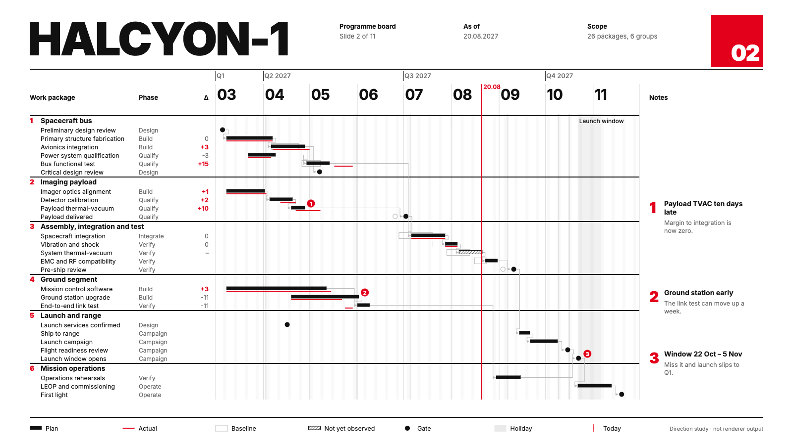

# HALCYON-1 target "Swiss Grid": the programme board in the International Typographic Style

A hand-drawn design target, approved by the product owner on 2026-09-26 as one of seven added together (Swiss Grid, Blueprint, Transit Map, Pixel Quest, Pastel Symmetry, One Bit, Flat Pack), alongside target B (#453) and the earlier targets in sibling folders under `docs/research/presentation/`. It is **not** chrona output. The coordinates are written by hand in `swiss-board.html`, and text widths are estimated, not measured.

The data and canvas are the same as the other targets: the HALCYON-1 programme board, 26 work packages in six groups, baseline, plan and actual, dependencies, as-of 2027-08-20, three annotations and the launch window, on 1600 × 900.

## What the direction is

The International Typographic Style of mid-century Swiss posters: a strict column grid, one sans-serif family, black on white, one red. No ornament; hierarchy comes only from size, weight and position.

It is the most directly usable of the targets, and the closest to a default preset for everyday reviews. It also balances the catalogue: every other target carries a strong theme.

| Element | Chart element | chrona role | Today |
| --- | --- | --- | --- |
| 12-column grid | Layout | table columns, plot edges, notes column and title fields all start on one declared grid | slots are sized independently; no shared grid |
| Two-digit months `03` … `11`, small `Q2 2027` above | Axis tiers | bold numeric month tier, small quarter tier with rules | tier appearance (#426) |
| Group rules, no bands | Group headers | 2 px black rule, red group number, bold title | expressible |
| One red | Paint | red only for slips, actual lines and today | expressible; contrast policy #459 |
| Red numbers at marks, same numbers in the notes column | Annotations | numbered marker at the mark; notes column aligned to rows | numbered marker exists; row alignment (#453, #466) |
| Circle gates | Gates | filled circle, baseline as outline | expressible (circle symbol) |
| Red slide-number block `02` | Title block | slide number as a filled block on the grid | no slide-number slot |

## What this target adds beyond the others

1. **A shared layout grid**: every slot edge snaps to declared columns, so the table, plot and notes line up with the title fields above them.
2. **Typographic hierarchy only**: the target should be reachable with rules, weights and one accent. It is a good test that the default Theme is not relying on fills.
3. **A slide-number slot**.

## Regenerating the image

Open `swiss-board.html` in a browser. The PNG in this folder was produced with headless Chrome, at a 1600 × 900 window, from a copy of the page that shows only the slide:

    "Google Chrome" --headless=new --hide-scrollbars --window-size=1600,900 \
      --virtual-time-budget=12000 --screenshot=02-programme-board.png stage-only.html
