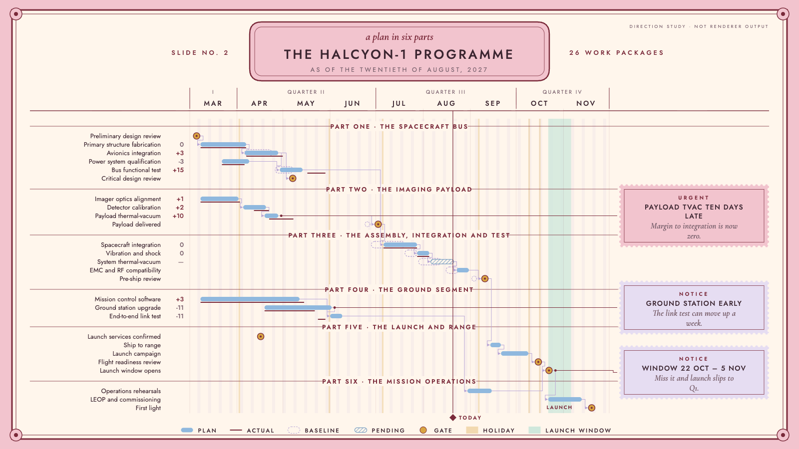

# HALCYON-1 target "Pastel Symmetry": the programme board in symmetrical pastel

A hand-drawn design target, approved by the product owner on 2026-09-26 as one of seven added together (Swiss Grid, Blueprint, Transit Map, Pixel Quest, Pastel Symmetry, One Bit, Flat Pack), alongside target B (#453) and the earlier targets in sibling folders under `docs/research/presentation/`. It is **not** chrona output. The coordinates are written by hand in `symmetry-board.html`, and text widths are estimated, not measured.

The data and canvas are the same as the other targets: the HALCYON-1 programme board, 26 work packages in six groups, baseline, plan and actual, dependencies, as-of 2027-08-20, three annotations and the launch window, on 1600 × 900.

## What the direction is

A grand hotel lobby in pastel, after the symmetrical, confectionery-coloured films of the 2010s: everything mirrored about the centre line, a cartouche for the title, each group announced as a chapter, notes on perforated cards. No film title, character or hotel name is used.

| Element | Chart element | chrona role | Today |
| --- | --- | --- | --- |
| Mirror symmetry | Layout | table and notes rail of equal width either side of a centred plot; title, chapters and legend centred | slots sized independently; no mirror constraint |
| Cartouche | Title | centred title in an ornamental frame, italic line above, dated line below | no framed or multi-line title block |
| `PART ONE · THE SPACECRAFT BUS` | Group headers | composed text centred across the full width, rules either side | composed header text (also Sunday Strip) |
| Right-aligned names, no phase column | Table | names aligned against the plot | column alignment exists |
| Perforated cards `URGENT` / `NOTICE` | Annotations | stamp-edged cards with a small-caps kind line | #465 |
| Double frame with corner rosettes | Slide | frame treatment | no frame treatment |
| Centred legend | Legend | horizontal, centred | #427 |

## What this target adds beyond the others

1. **A symmetry constraint** in Layout: paired slots with equal widths about the slide's axis.
2. **Centred composition**: title, chapter headers and legend on the centre line.
3. **A written-out date** in the title block (`the twentieth of August, 2027`).

## Regenerating the image

Open `symmetry-board.html` in a browser. The PNG in this folder was produced with headless Chrome, at a 1600 × 900 window, from a copy of the page that shows only the slide:

    "Google Chrome" --headless=new --hide-scrollbars --window-size=1600,900 \
      --virtual-time-budget=12000 --screenshot=02-programme-board.png stage-only.html
