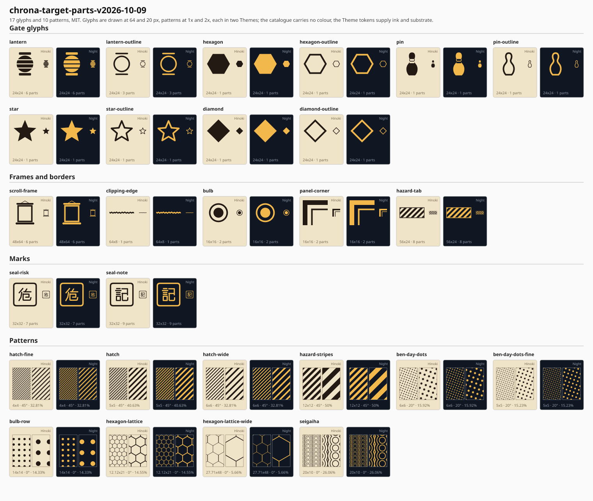

# Target parts catalogue: `chrona-target-parts-v2026-10-09`



The reusable design parts of the 14 hand-drawn targets (PR #461, sibling folders `*-target-2026-09-26/`) and of target B,
extracted as monochrome Theme assets and packaged in the wheel (#718, depth C: resources only, no core change). It is the
set `chrona-target-parts` (alias `target-parts`), MIT, original geometry, shipped as four files under
`src/chrona/resources/icons/`: the authored `*.source.yaml`, the importer's canonical `*.yaml` (`icon-catalog/v0.5`), the
`*.manifest` with hashes, densities and consumers, and `chrona-target-parts.NOTICE`. The design is in
[the design](../../../design/issue-718-target-parts-catalogue-design-2026-10-02.md).

A part carries **no colour**: a Theme paints every part from its role colour (or, for a baseline outline treatment, as a
stroke), so the gallery above draws the same geometry in a light and a dark Theme. Glow, dash, wobble, tilt and light
cones are Theme treatments and are not in the assets.

| Kind | Entries | Consumer today |
| --- | --- | --- |
| gate glyphs | `lantern`, `hexagon`, `pin`, `star`, `diamond` and their `-outline` twins | `milestoneSymbol`, `milestoneSymbolActual`, `milestoneSymbolBaseline` |
| patterns | `hatch-fine`, `hatch`, `hatch-wide`, `hazard-stripes`, `ben-day-dots`, `ben-day-dots-fine`, `bulb-row`, `hexagon-lattice`, `hexagon-lattice-wide`, `seigaiha` | the Rect-only role/property pairs of Specification 07 |
| border and corner glyphs | `bulb`, `panel-corner` | none yet (#587) |
| kind corner and stamps | `hazard-tab`, `seal-risk`, `seal-note` | none yet (#584) |
| container artwork | `scroll-frame`, `clipping-edge` | none yet (#848) |

The `seigaiha` pattern uses the nine ordered circle primitives added for #849:
substrate-filled outer circles and stroked inner circles at (0,10), (20,10),
and (10,5), with radii 10, 7, and 4.

## Use

```bash
chrona render project.yaml --theme theme.yaml --icon-catalog src/chrona/resources/icons/chrona-target-parts-v2026-10-09.yaml -o board.svg
```

A Theme binds an entry by `set:name`: `shape: {catalog: 'chrona-target-parts:lantern'}` on `milestone-symbol`, or a pattern
token `{kind: catalog, ref: 'chrona-target-parts:hazard-stripes'}` on a registered role. An unknown name fails with
`E_THEME_ASSET_REFERENCE` at the Theme pointer.

## Files here

| File | Content |
| --- | --- |
| `gallery.svg`, `gallery.png` | every entry at two sizes in two Themes (Hinoki, Night); glyphs at 64 and 20 px, patterns at 1x and 2x |
| `render_gallery.py` | draws the gallery from the shipped catalogue with two token sets; the PNG uses the pinned resvg route |
| `build_source.py` | the formulas that produced the paths in the source YAML; `--write` rewrites it, with no flag it checks that the committed source is reproduced |

Regenerate the gallery with `python docs/research/presentation/target-parts-catalogue-2026-10/render_gallery.py`.

Each target's README has a section "Parts catalogue (#718)" that lists which of its parts are in the catalogue and which of
#582 to #588 it still needs.
