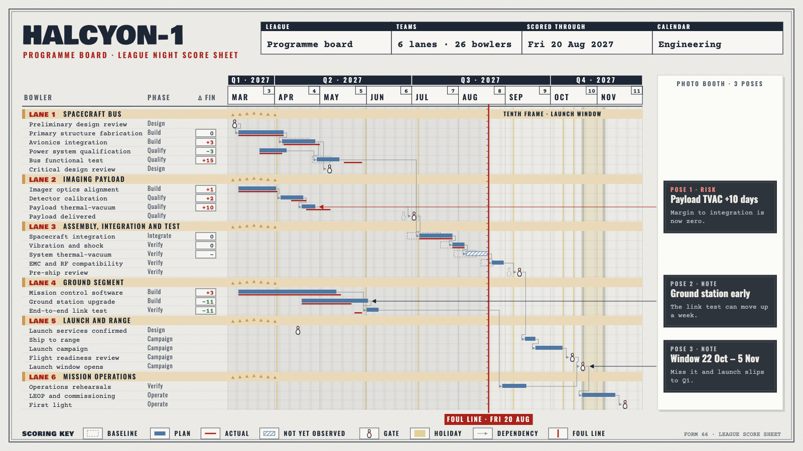

# HALCYON-1 target "Tenth Frame": the programme board as a bowling score sheet

A hand-drawn design target, approved by the product owner on 2026-09-26 as a fifth visual goal, alongside target B (#453), Marquee (`../marquee-target-2026-09-26/`), Montmartre (`../montmartre-target-2026-09-26/`) and Off-World (`../offworld-target-2026-09-26/`). It is **not** chrona output. The coordinates are written by hand in `tenthframe-board.html`, and text widths are estimated, not measured.

The data and canvas are the same as the other targets: the HALCYON-1 programme board, 26 work packages in six groups, baseline, plan and actual, dependencies, as-of 2027-08-20, three annotations and the launch window, on 1600 × 900.

## What the direction is

A bowling alley in a late-1990s Buffalo winter: a league-night score sheet, slush grey and navy ink, lane maple and carpet mustard, a photo booth by the door. No film logo, title treatment or character is used; only the alley's printed forms and fittings. Two accents stand in for the period's costume colours: a powder blue for the plan and a boot red for what actually happened.

It is the first light, cold, printed target. Marquee and Off-World are dark, and Montmartre is warm and handwritten.

| Element | Chart element | chrona role | Today |
| --- | --- | --- | --- |
| Score-sheet header | Title | title block as labelled form fields (`LEAGUE`, `TEAMS`, `SCORED THROUGH`, `CALENDAR`) filled from project facts | title and subtitle only; no field grid |
| Frames | Month tier | boxed axis cells, each with a small corner box holding the month number | tier appearance (#426); no sub-box in a cell |
| Lanes 1–6 | Group headers | maple band with a `LANE n` prefix and the lane's arrow marks | per-group prefix and decoration (#453) |
| Score boxes | `Δ FIN` column | each value in a ruled box; slip red, early green | no per-cell box treatment |
| Pins | Gates | milestone drawn as a custom glyph; the baseline gate as its dashed outline | see below |
| Bars | Plan, baseline, actual | plan in blue, baseline dashed ghost, actual red line, unobserved hatched | expressible (#398, dash #423) |
| Foul line | As-of | heavy solid line; the elapsed side of the plot shaded as the approach | no elapsed-region shading; label (#428) |
| Tenth frame | Launch window | named band with double-ruled edges | no named ranges (#453) |
| Photo-booth strip | Annotations | one continuous strip down the rail, one frame per note, each frame row-aligned, leaders to the mark | rail and row alignment (#453); no shared container across notes |
| Scoring key | Legend | horizontal legend, each swatch in a ruled box | square swatches only (#427) |

**Pins, in detail.** The icon vocabulary (specification 64) already lets a View lay a catalogue icon over one named planned or actual mark (`target: {kind: mark}`), drawn inside the host mark's bounds. What this target needs is different: every gate drawn *as* a glyph instead of the diamond, chosen by rule for all milestones, with the baseline gate as the same glyph's outline. The product owner singled this element out as the one to keep.

## What this target adds beyond the others

1. **Milestones as a glyph, by rule**: a marker shape taken from an icon or path, applied to every gate, with an outline variant for the baseline.
2. **A title block made of form fields**: labelled cells whose values come from project facts, not a single title string.
3. **Elapsed-time shading**: the part of the plot before as-of is tinted, so past and future read apart at a glance.
4. **Cell boxes**: a ruled box around a table value, and a corner sub-box in an axis cell.
5. **One container across several annotations**: the strip is drawn once, and the notes are frames within it, each still aligned to its own row.

## Regenerating the image

Open `tenthframe-board.html` in a browser. The PNG in this folder was produced with headless Chrome, at a 1600 × 900 window, from a copy of the page that shows only the slide:

    "Google Chrome" --headless=new --hide-scrollbars --window-size=1600,900 \
      --virtual-time-budget=8000 --screenshot=02-programme-board.png stage-only.html
