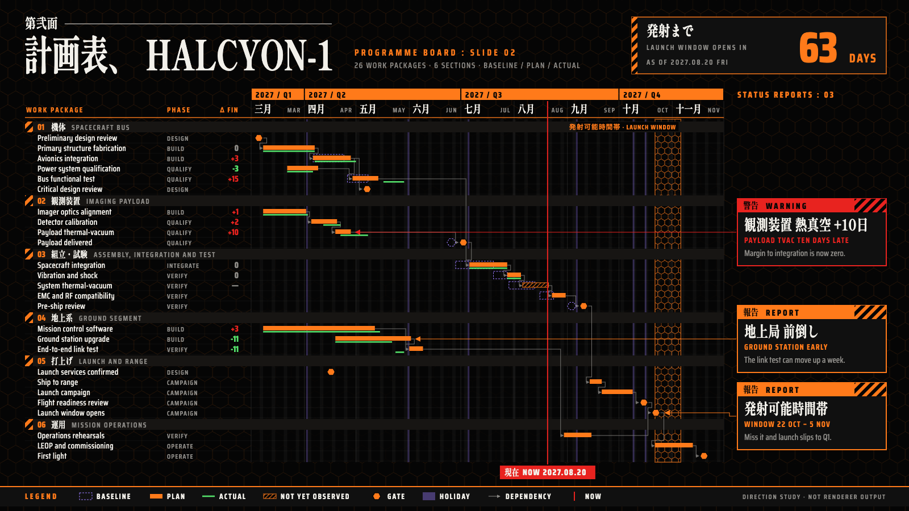
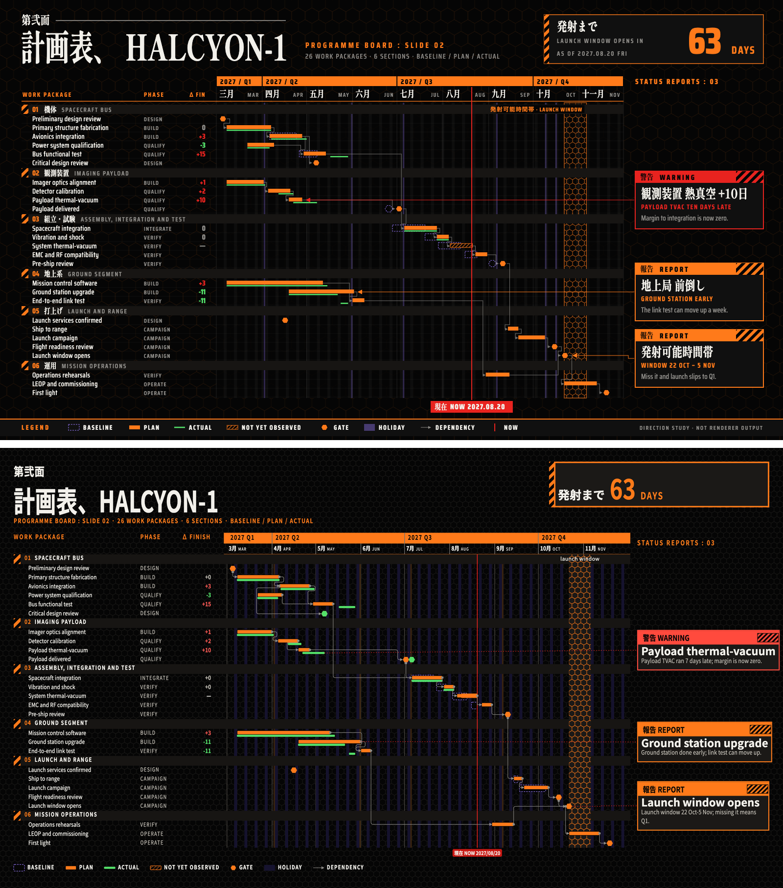

# HALCYON-1 target "Title Card": the programme board as an anime command-centre screen

A hand-drawn design target, approved by the product owner on 2026-09-26 as a seventh visual goal, alongside target B (#453), Marquee, Montmartre, Off-World, Tenth Frame and Yuya (sibling folders under `docs/research/presentation/`). It is **not** chrona output. The coordinates are written by hand in `titlecard-board.html`, and text widths are estimated, not measured.

The data and canvas are the same as the other targets: the HALCYON-1 programme board, 26 work packages in six groups, baseline, plan and actual, dependencies, as-of 2027-08-20, three annotations and the launch window, on 1600 × 900.

## What the direction is

The visual language of a late-1990s anime: episode title cards set in heavy Mincho compressed horizontally, and command-centre screens in pure black, warning orange and alert red, with hexagon lattices and hazard stripes. No series logo, organisation name or emblem, character or mecha is used.

The product owner took this target **as a whole**: the value is the complete composition, not one borrowed element. It is also the target that shows most clearly that a Theme can carry a strong, playful identity, which is what a preset catalogue (#429) is for.

Off-World is also dark and screen-like. This one is deliberately different: no glow or neon, flat alarm colours, and type as the main event.

| Element | Chart element | chrona role | Today |
| --- | --- | --- | --- |
| Title card: `第弐面`, then `計画表、 HALCYON-1` in an L-shaped block | Title | multi-part title block; heavy Mincho **compressed horizontally** | no horizontal text scale; title and subtitle only |
| Countdown, `発射まで 63 DAYS` | Header figure | a figure derived from project facts (as-of to launch window) shown as a large display value | no derived summary figure in the header |
| Orange band `2027 / Q1`, compressed Mincho `三月` with a small `MAR` | Axis tiers | filled quarter tier, bilingual month tier | tier appearance (#426); vocabulary follows locale (#432) |
| Hazard-stripe tab, `01 機体 SPACECRAFT BUS` | Group headers | group band with a patterned tab, a number and a bilingual title | per-group prefix and decoration (#453) |
| Hexagons | Gates | every gate a hexagon by rule; the baseline gate its dashed outline | no hexagon marker; icons lay over one named bar only (see Tenth Frame) |
| Bars | Plan, baseline, actual | plan orange, baseline dashed purple ghost, actual green line, unobserved hatched | expressible (#398, dash #423) |
| `現在 NOW 2027.08.20` | As-of | red line with a filled label block | label chip (#428) |
| Hexagon lattice, `発射可能時間帯` | Launch window | named range with a pattern fill | no named ranges (#453); no pattern fill for a range |
| `警告 WARNING` / `報告 REPORT` panels | Annotations | bordered panel with a coloured title bar and hazard corner by kind, a large heading, an English sub-line, then the note | rail and row alignment (#453); no title bar |
| Faint hexagon lattice over the canvas | Whole slide | canvas pattern | no canvas texture (also Montmartre, Off-World) |

## What this target adds beyond the others

1. **Horizontal compression as a text treatment**: a scale factor on a typographic role, measured at its compressed width.
2. **A derived header figure**: a value computed from the project (days from as-of to a named date), shown as a display number with its caption.
3. **Title bars on annotations**, coloured by kind, with the kind's label in two scripts.
4. **Hexagon gates** join Tenth Frame's pins and Yuya's lanterns: three targets now ask for gates drawn as a glyph by rule.

## Regenerating the image

Open `titlecard-board.html` in a browser. The PNG in this folder was produced with headless Chrome, at a 1600 × 900 window, from a copy of the page that shows only the slide:

    "Google Chrome" --headless=new --hide-scrollbars --window-size=1600,900 \
      --virtual-time-budget=12000 --screenshot=02-programme-board.png stage-only.html

Chrome may not exit after writing the file while the Japanese web fonts load; the PNG is complete once written.

## Parts catalogue (#718)

The reusable parts of this target are extracted as monochrome assets in the packaged catalogue `chrona-target-parts-v2026-10` (set `chrona-target-parts`; see [the gallery](../target-parts-catalogue-2026-10/README.md)). A part carries no colour: the Theme paints it. `chrona-starter` is the older builtin catalogue.

| Part drawn here | Catalogue entry | Status |
| --- | --- | --- |
| Hexagon gate, solid and baseline outline | `chrona-target-parts:hexagon`, `hexagon-outline` | in the catalogue; bindable as a gate symbol today |
| Hexagon lattice: launch window and canvas | `chrona-target-parts:hexagon-lattice`, `hexagon-lattice-wide` | in the catalogue; bindable as a pattern on the Rect roles today |
| Hazard stripes | `chrona-target-parts:hazard-stripes` | in the catalogue; bindable as a pattern on the Rect roles today |
| Hazard-stripe tab (group tab, kind corner) | `chrona-target-parts:hazard-tab` | in the catalogue; not yet placeable by any Theme role (#584) |
| Hatch for unobserved work | `chrona-target-parts:hatch` | in the catalogue; bindable as a pattern on the Rect roles today |

Still needed before this target's preset can be assembled: #582 (launch window as a patterned range), #583 (the numbered hazard tab on each group header), #584 (title bar and hazard corner by annotation kind), #585 (horizontal compression), #586 (the countdown figure), #587 (the canvas lattice).

## Reproduction (#1182)

**Signed off by the product owner on 2026-10-10.** The image shows main after the owner's 2026-10-08 review (font, label frame, annotation bar and stripe flush with the panel border, quarter label margin, month boundaries) and after fitting the slide to 1600 × 900 (PR #1272).

The bottom image is the HALCYON-1 slide `titlecard` (`examples/halcyon-1`), rendered from YAML alone: View `views/23-titlecard.yaml`, Theme `themes/titlecard.yaml`, scheme `schemes/titlecard.yaml`, Layout and profiles `layouts/titlecard.yaml`, `profiles/titlecard-detail.yaml` and `profiles/titlecard-countdown.yaml`, and Context `contexts/23-titlecard.yaml`.

### Gap table

Classification: (a) tuned in YAML; (b) a missing general knob, filed and delivered; (c) a deliberate difference.

| Element | Result | Class | Through |
|---|---|---|---|
| Black ground, flat alarm palette, faint hexagon lattice | matches | a, b | #587 |
| Horizontally compressed title with the `第弐面` kicker above it | matches (face differs, see below) | b | #585, #1189 |
| Countdown `発射まで 63 DAYS` with a derived figure | matches | b | #586, #1190 |
| Orange quarter tier and bilingual month tier | matches (Arabic month numerals) | a, b | #426, #493 |
| Hazard-stripe group tabs with an orange ordinal | matches | b | #882, #1192 |
| Hexagon gates, with an outlined baseline gate | matches | b | #464 |
| Plan, ghost, actual and hatch marks | matches | a | |
| Kind bar and hazard stripe flush with the panel border | matches | b | #1242 |
| Quarter labels inset from the tier edge; month boundaries drawn | matches | a | owner review 2026-10-08 |
| Canvas fits 1600 × 900 | matches (row pitch from the mock) | a | #1272 |
| `現在 NOW` as-of line and chip | matches | b | #1063, #1110 |
| Hexagon-lattice launch window | matches | b | #582, #911 |
| `警告 WARNING` / `報告 REPORT` panels: full-width title bar, 22 px heading, body | matches | b | #1191, #1201 |
| Heavy Mincho face | Noto Sans JP. chrona packages no extra face (owner, 2026-10-06); users can import their own Mincho (#983) | c | owner decision |
| Kanji month names (三月), a dotted date (2027.08.20), a `NOW` legend entry, Japanese group titles | not expressible, or not in the project data | c | |
| The rule beside the kicker; the two small caption lines under `発射まで` | absent | c | ornament and missing data |
