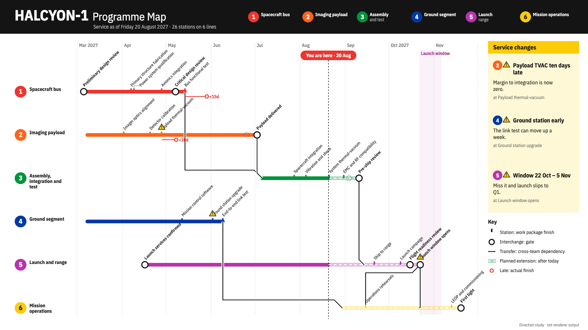

# HALCYON-1 target "Transit Map": the programme as a transit map

A hand-drawn design target, approved by the product owner on 2026-09-26 as one of seven added together (Swiss Grid, Blueprint, Transit Map, Pixel Quest, Pastel Symmetry, One Bit, Flat Pack), alongside target B (#453) and the earlier targets in sibling folders under `docs/research/presentation/`. It is **not** chrona output. The coordinates are written by hand in `transit-board.html`, and text widths are estimated, not measured.

The data and canvas are the same as the other targets: the HALCYON-1 programme board, 26 work packages in six groups, baseline, plan and actual, dependencies, as-of 2027-08-20, three annotations and the launch window, on 1600 × 900.

## What the direction is

A 1970s subway diagram: each team is a coloured line, each finished work package a station, gates are interchange stations, cross-team dependencies are transfers, and everything after today is a planned extension. It trades bar lengths for a view of flow and handoffs.

This is a **different surface**, not a Theme over the table-timeline: the same Project projected onto lines and stations.

| Element | Chart element | chrona role | Today |
| --- | --- | --- | --- |
| Six coloured lines | Groups | one track per group from its first start to its last finish | no line-per-group surface |
| Stations and interchanges | Work packages, gates | a stop at each planned finish; gates as interchange rings | no station projection |
| 45° station names, offset when stops crowd | Labels | rotated labels with a deterministic stagger | rotation exists for axis labels only (#443) |
| Transfers | Cross-group dependencies | links with 45° bends from a finish to the dependent start | dependency routing is orthogonal (#416) |
| Pale dashed extension after today | As-of | styling split at the as-of date | no styling split at as-of |
| Red stop beyond the planned one, `+15d` | Slips | actual finish as a separate stop joined to the plan | no station projection |
| Service changes panel | Annotations | notices with the line bullet and a warning glyph at the station | rail (#466) |

## What this target adds beyond the others

1. **A second surface over the same Project**, with its own layout: tracks, stations, transfers. It is the first target that tests whether chrona's pipeline can host a surface other than the table-timeline.
2. **A styling split at as-of**: one mark drawn differently before and after today.
3. **Staggered rotated labels**.

## Regenerating the image

Open `transit-board.html` in a browser. The PNG in this folder was produced with headless Chrome, at a 1600 × 900 window, from a copy of the page that shows only the slide:

    "Google Chrome" --headless=new --hide-scrollbars --window-size=1600,900 \
      --virtual-time-budget=12000 --screenshot=02-programme-board.png stage-only.html
