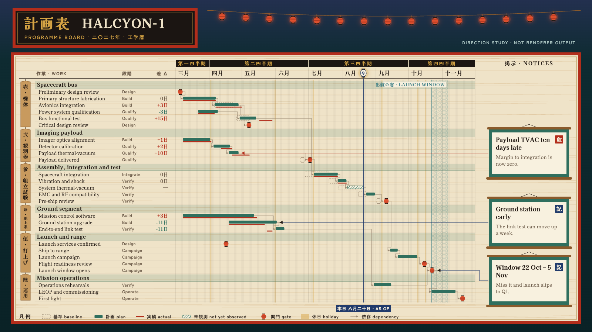
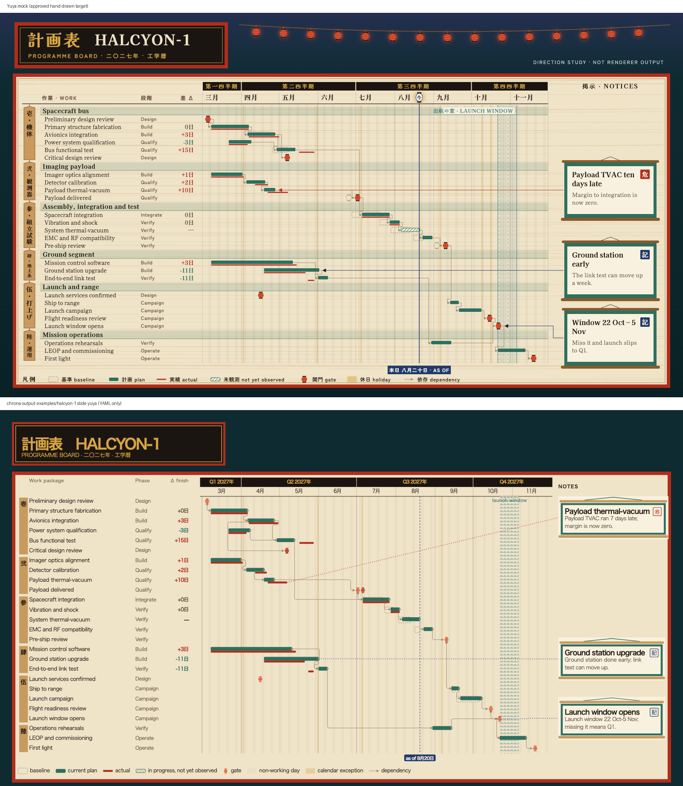

# HALCYON-1 target "Yuya": the programme board posted at a bathhouse

A hand-drawn design target, approved by the product owner on 2026-09-26 as a sixth visual goal, alongside target B (#453), Marquee, Montmartre, Off-World and Tenth Frame (sibling folders under `docs/research/presentation/`). It is **not** chrona output. The coordinates are written by hand in `yuya-board.html`, and text widths are estimated, not measured.

The data and canvas are the same as the other targets: the HALCYON-1 programme board, 26 work packages in six groups, baseline, plan and actual, dependencies, as-of 2027-08-20, three annotations and the launch window, on 1600 × 900.

## What the direction is

The notice board of an old wooden bathhouse across a night river, in the vernacular of Japanese bathhouses and inns: a lacquered name plaque, hanging wooden tags, paper lanterns, hanging scrolls, the seigaiha wave pattern. No film logo, title treatment or character is used.

## What to take from this target

The product owner's reading is narrower than the other targets. **Two things are the point:**

### 1. The colour scheme

A lit wooden board against a dark ground, with each colour assigned one job:

| Name | Value | Job |
| --- | --- | --- |
| Night river | `#0E2B31` | slide ground outside the board |
| Hinoki | `#EFE3C8` | board surface: the plot, table and rail sit on it |
| Ink | `#231A14` | text and rules |
| Roof-tile green | `#2F6F5E` | plan bars; early deltas; group band tint |
| Lacquer red | `#B22D1B` | actual line, board frame, slip deltas, risk seal |
| Lantern vermilion | `#E0512F` | gates |
| Indigo | `#203A6B` | as-of line and label, note seal |
| Gold | `#D6A444` | title lettering, quarter tier, holidays |
| Ghost | `#9C8B74` | baseline, dependencies |
| Sea | `#3E7F86` | launch window |

Two structural points go with the palette. The slide has **two grounds**: a dark canvas and a light board inset on it. Data sits only on the light board, so its contrast is measured against hinoki, not the canvas; this is the case #459 describes. The quarter tier is a dark band on the light board (tier appearance, #426).

### 2. A background image for each annotation

Each note is drawn over an image of a hanging scroll: a mounting, paper, rods at top and bottom, and a hanger. The note's text is laid out inside the paper area, and the image grows with the text. Today chrona can place a catalogue icon (vector or raster, specification 64) beside a label or over a single mark. It cannot put an image *behind* a container and size it to that container's content. A usable version needs:

- an image (from the icon catalogue, or a similar asset) bound to the annotation container by the Theme;
- stretch rules, so the rods keep their size while the paper grows: nine-slice or a declared content box;
- a content inset, so text is measured into the paper area and not into the mounting;
- the same checks as any other paint: the text must meet contrast against the image's content area.

The same mechanism would serve the Tenth Frame photo-booth frames, the Marquee newspaper clippings and the Off-World printouts, so it is one gap, not a per-theme effect.

## Other elements, recorded but not required

| Element | Chart element | Today |
| --- | --- | --- |
| Vertical group tags spanning each group's rows (壱 to 陸) | Group labels | no vertical text; no row-spanning group column |
| 三月 … 十一月, 第一四半期 | Axis labels | vocabulary follows locale (#432) |
| Lantern glyph for every gate, outline for the baseline gate | Gates | same need as Tenth Frame's pins |
| Seigaiha fill | Launch window | no named ranges (#453); no pattern fill for a range |
| Seal stamp 危 / 記 | Annotation kind | no stamp mark |

## Regenerating the image

Open `yuya-board.html` in a browser. The PNG in this folder was produced with headless Chrome, at a 1600 × 900 window, from a copy of the page that shows only the slide:

    "Google Chrome" --headless=new --hide-scrollbars --window-size=1600,900 \
      --virtual-time-budget=12000 --screenshot=02-programme-board.png stage-only.html

Chrome may not exit after writing the file while the Japanese web fonts load; the PNG is complete once written.

## Parts catalogue (#718)

The reusable parts of this target are extracted as monochrome assets in the packaged catalogue `chrona-target-parts-v2026-10` (set `chrona-target-parts`; see [the gallery](../target-parts-catalogue-2026-10/README.md)). A part carries no colour: the Theme paints it. `chrona-starter` is the older builtin catalogue.

| Part drawn here | Catalogue entry | Status |
| --- | --- | --- |
| Lantern gate, solid and baseline outline | `chrona-target-parts:lantern`, `lantern-outline` | in the catalogue; bindable as a gate symbol today |
| Hatch for unobserved work | `chrona-target-parts:hatch` | in the catalogue; bindable as a pattern on the Rect roles today |
| Seigaiha for the launch window | `chrona-starter:seigaiha` (approximate) | not re-extracted: overlapping scales need an occluding pattern primitive (#849); needs a named range to be placed (#582) |
| Seal stamps `危` and `記` | `chrona-target-parts:seal-risk`, `seal-note` | in the catalogue; not yet placeable by any Theme role (#584) |
| Hanging-scroll mounting | `chrona-target-parts:scroll-frame` | in the catalogue; not yet placeable by any Theme role (#848); the PNG container of #465 exists, but a bundled catalogue is vector-only |

Still needed before this target's preset can be assembled: #582 (the launch window as a named, patterned range), #583 (decorated group tags), #585 (vertical group labels), #584 (a stamp per annotation kind). #848 for the scroll as vector container artwork.

## Reproduction (#1116)

The bottom image is the HALCYON-1 slide `yuya` (`examples/halcyon-1`, PR #1123), rendered from YAML alone: View `views/22-yuya.yaml`, Theme `themes/yuya.yaml`, scheme `schemes/yuya.yaml`, Layout and profile `layouts/yuya.yaml` and `profiles/yuya-detail.yaml`, and Context `contexts/22-yuya.yaml`. The owner signed it off visually on 2026-10-06.

### Gap table

Classification: (a) tuned in YAML; (b) a missing general knob, filed and delivered; (c) a deliberate difference.

| Element | Result | Class | Through |
|---|---|---|---|
| Two grounds: night-river canvas around a hinoki board, red board frame | matches | b | #1165, #1163 |
| Lacquer title plaque with gold lettering and a gold inner rule | matches | b | #1164, #1165 |
| Palette with one job per colour (plan green, actual lacquer red, gates vermilion, as-of indigo, launch window sea) | matches | a | scheme `yuya` |
| Hanging scroll behind each note: two-tone mounting and rods, text laid in the paper | matches | b | #848, #1167 |
| Note heading over a muted body; 危 / 記 seals | matches | a | #584 |
| Vertical group tags 壱 to 陸 on wood plates | matches (ordinal only; the group titles are English data) | b, a | #585, #1166 |
| Group rows untinted, so the grouping is carried by the plates | owner choice B | a | owner, 2026-10-06 |
| Lantern gates and the seigaiha launch window | matches | a, b | #464, #582, #1178 |
| Finish deltas in days (+3日) | matches | a | #588 |
| Dependencies entering from the side, with fan-in sharing a head | matches | b | #1109 |
| Kanji month and quarter names (三月, 第一四半期) | `3月` and `Q1 2027年` | c | needs a View enum |
| Mincho / serif faces | Noto Sans JP | c | #983 |
| Lantern string, wood grain, glow behind lanterns | absent | c | ornament, low priority |
